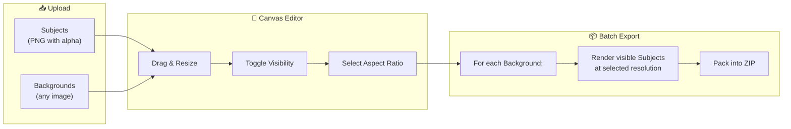
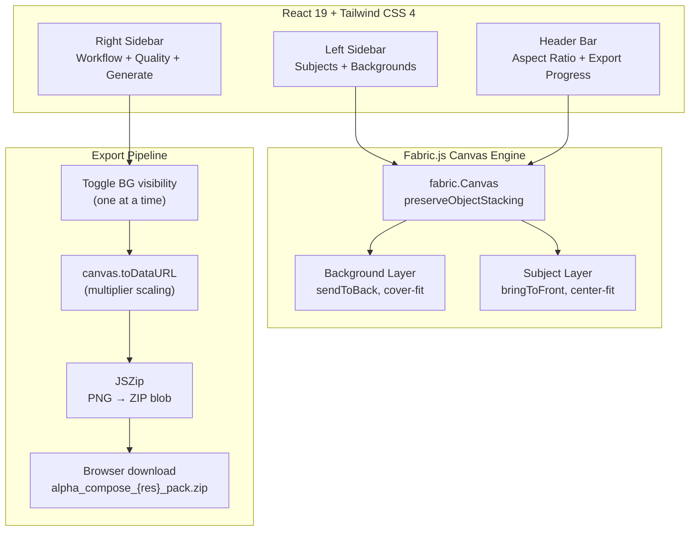

# 🎨 Alpha Compose

> **Precision Image Orchestrator** — Compose subjects over backgrounds and batch-export high-resolution packs up to 4K.

[](https://react.dev)
[](https://typescriptlang.org)
[](https://vite.dev)
[](http://fabricjs.com)
[](https://tailwindcss.com)
[](LICENSE)

---

## ✨ Features

- **🖼️ Multi-layer composition** — Upload subjects (PNG with alpha) and backgrounds separately
- **🎯 Fabric.js canvas** — Drag, resize, rotate and position layers with precision controls
- **👁️ Per-layer visibility** — Toggle which subjects appear in each export
- **📐 Aspect ratio presets** — 1:1, 3:4, 9:16, 4:3, 16:9
- **📦 Batch export** — Iterates all backgrounds × visible subjects automatically
- **🔥 Resolution scaling** — Export ZIP packs in 1K, 2K or 4K
- **💨 100% client-side** — Zero API calls, zero backend, zero data leaves your browser
- **⚡ Instant preview** — Real-time composition with live canvas rendering

---

## 🚀 Quick Start

**Prerequisites:** [Node.js](https://nodejs.org) 18+

```bash
git clone https://github.com/vandre-sales/Alpha-Compose.git
cd Alpha-Compose
npm install
npm run dev
```

Open **[http://localhost:3000](http://localhost:3000)** in your browser.

---

## 📐 How It Works



### Workflow in 4 Steps

| Step | Action | Result |
|:---:|---|---|
| **1** | Upload **subjects** (transparent PNGs) | Layers added to Subjects panel |
| **2** | Upload **backgrounds** (any images) | Layers added to Backgrounds panel |
| **3** | **Arrange** subjects on canvas — drag, resize, toggle visibility | Live preview updates |
| **4** | Click **Generate Pack** | ZIP downloaded with one composed image per background |

---

## 🖥️ Export Resolutions

| Quality | Total Pixels | Equivalent | Best For |
|:---:|:---:|---|---|
| **1K** | 1 MP | 1024 × 1024 | Social media, thumbnails |
| **2K** | 4 MP | 2048 × 2048 | Web, presentations, e-commerce |
| **4K** | 16 MP | 4096 × 4096 | Print, high-res marketing assets |

Resolution scales proportionally to the selected aspect ratio. The export multiplier is calculated as:

```
targetWidth = √(totalPixels × aspectRatio)
multiplier = targetWidth / canvasWidth
```

---

## 🏗️ Architecture



---

## 🏗️ Tech Stack

| Technology | Version | Purpose |
|---|:---:|---|
| [**React**](https://react.dev) | 19 | UI framework with hooks |
| [**TypeScript**](https://typescriptlang.org) | 5.8 | Type safety across the codebase |
| [**Vite**](https://vite.dev) | 6 | Build tool with HMR |
| [**Fabric.js**](http://fabricjs.com) | 7 | Canvas manipulation engine |
| [**Tailwind CSS**](https://tailwindcss.com) | 4 | Utility-first styling |
| [**JSZip**](https://stuk.github.io/jszip/) | 3 | Client-side ZIP generation |
| [**Framer Motion**](https://motion.dev) | 12 | UI animations |
| [**Lucide React**](https://lucide.dev) | — | Icon library |

---

## 📁 Project Structure

```
Alpha-Compose/
├── index.html              # Entry point
├── package.json            # Dependencies & scripts
├── vite.config.ts          # Vite + Tailwind + React config
├── tsconfig.json           # TypeScript config
├── LICENSE                 # MIT
├── README.md               # This file
├── metadata.json           # Project metadata
└── src/
    ├── main.tsx            # React DOM entry
    ├── App.tsx             # Main app — upload, sidebar, export logic
    ├── index.css           # Tailwind imports + font config
    ├── types.ts            # TypeScript types, aspect ratios, resolutions
    ├── lib/
    │   └── utils.ts        # cn() helper (clsx + tailwind-merge)
    └── components/
        └── CanvasEditor.tsx # Fabric.js canvas — sync, resize, layers
```

---

## 📦 Scripts

| Command | Description |
|---|---|
| `npm run dev` | Start dev server on port 3000 |
| `npm run build` | Build for production (`dist/`) |
| `npm run preview` | Preview production build |
| `npm run lint` | TypeScript type checking |
| `npm run clean` | Remove `dist/` folder |

---

## 🤝 Contributing

Contributions are welcome! Feel free to open issues or submit PRs.

1. Fork the repository
2. Create your feature branch (`git checkout -b feature/amazing-feature`)
3. Commit your changes (`git commit -m 'feat: add amazing feature'`)
4. Push to the branch (`git push origin feature/amazing-feature`)
5. Open a Pull Request

---

## 📄 License

[MIT](LICENSE) — **Vandre Sales** 2026

---

<div align="center">

**Built with** ❤️ **using React, Fabric.js & Vite**

[⬆ Back to top](#-alpha-compose)

</div>
