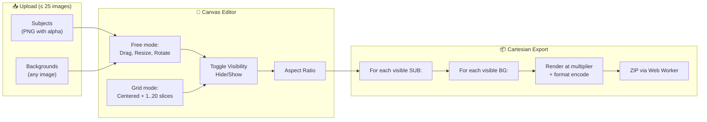
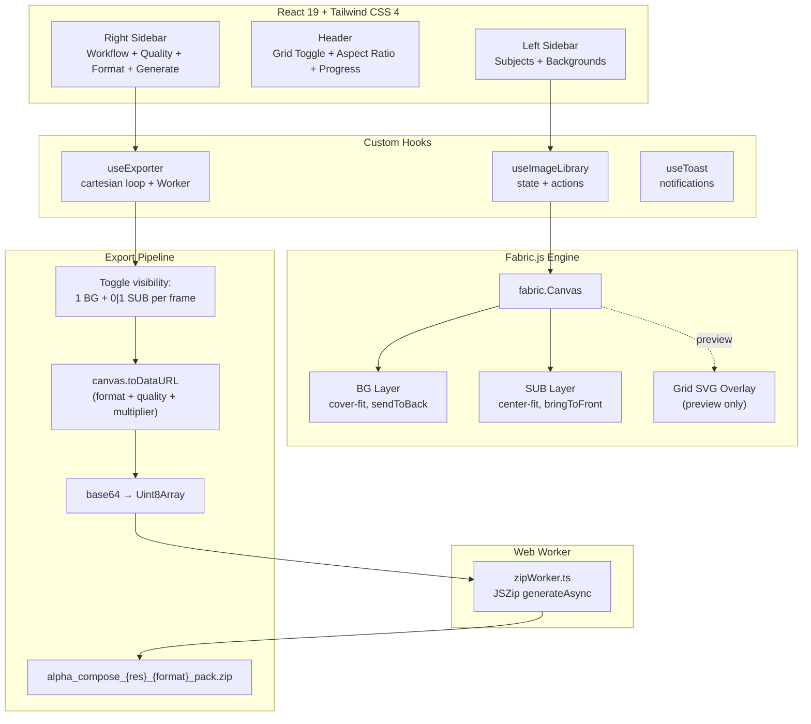

# 🎨 Alpha Compose

> **Precision Image Orchestrator** — Compose subjects over backgrounds, generate **N × A** combinations and batch-export high-resolution packs in PNG, JPG or WEBP up to 4K.

[](https://react.dev)
[](https://typescriptlang.org)
[](https://vite.dev)
[](http://fabricjs.com)
[](https://tailwindcss.com)
[](https://github.com/vandre-sales/Alpha-Compose/releases)
[](LICENSE)

---

## ✨ Features

### Core
- **🖼️ Multi-layer composition** — Upload subjects (PNG with alpha) and backgrounds separately
- **🎯 Fabric.js canvas** — Drag, resize, rotate and position layers with precision
- **👁️ Per-layer visibility** — Toggle which subjects/backgrounds appear in each export
- **📐 Aspect ratio presets** — `1:1`, `3:4`, `9:16`, `4:3`, `16:9`
- **💨 100% client-side** — Zero API calls, zero backend, zero data leaves your browser
- **⚡ Instant preview** — Real-time composition with live canvas rendering

### Export Engine (v0.3.0+)
- **🔢 Cartesian Export** — Generates `BGs(visible) × SUBs(visible)` combinations automatically
- **📦 Batch ZIP** — Up to **156 frames** per pack (12×13 limit)
- **🚫 No-merge invariant** — Each frame contains **exactly 1 BG + 1 SUB** (never combined)
- **🔥 Resolution scaling** — Export in 1K, 2K or 4K
- **📁 Multiple formats** — PNG (lossless), JPG (q=0.95), WEBP (lossless with alpha) — *v0.5.0*
- **⚡ Web Worker** — ZIP generation runs off the main thread (UI never freezes)
- **🛑 Cancelable export** — Stop mid-pack with one click

### Grid Mode (v0.4.0+)
- **⊞ Toggle Grid Mode** — Activate a 20×20 reference grid based on the canvas's smaller side
- **🎯 Centered & locked** — SUBs auto-center geometrically, lock position/rotation/manual scaling
- **➕➖ Discrete scale** — Adjust SUB size in steps of `1/20` of the canvas (per-SUB)
- **🔢 Visual indicator** — `[N/20]` badge on each subject card
- **🚿 Clean export** — Grid lines visible only in the preview, never written to PNG/JPG/WEBP

### Quality of Life
- **♿ Accessibility** — `aria-label`, `aria-pressed`, `aria-live`, focus rings on all controls
- **🔔 Toast notifications** — Replaces native `alert()` with smooth Motion-powered toasts
- **🎚️ Up to 25 images** — Total cap (BG + SUB combined, any combination)
- **🔒 Strict TypeScript** — `strict: true` enabled, zero `as any` in source
- **🛡️ Sanitized filenames** — Removes illegal characters for Windows/macOS/Linux

---

## 🚀 Quick Start

**Prerequisites:** [Node.js](https://nodejs.org) 18+

```bash
git clone https://github.com/vandre-sales/Alpha-Compose.git
cd Alpha-Compose
npm install
npm run dev
```

Open **[http://localhost:3000](http://localhost:3000)** in your browser.

---

## 📐 How It Works



### Workflow

| Step | Action | Result |
|:---:|---|---|
| **1** | Upload **subjects** (transparent PNGs) | Cards added to Subjects panel |
| **2** | Upload **backgrounds** (any images) | Cards added to Backgrounds panel |
| **3** | (Optional) Toggle **⊞ Grid ON** | SUBs auto-center; use `+`/`-` to resize discretely |
| **4** | Choose **aspect ratio**, **quality** (1K/2K/4K), **format** (PNG/JPG/WEBP) | UI updates live |
| **5** | (Optional) **Hide** SUBs/BGs you don't want in this batch | They're silently skipped |
| **6** | Click **Generate Pack** | Downloaded ZIP: `alpha_compose_{res}_{format}_pack.zip` |

---

## 🔢 Cartesian Export Engine

**Formula:**

```
RENDERED_IMAGES = BGs(show) × SUBs(show)
```

| Setup | Output |
|---|---|
| 3 BG visible + 1 SUB visible | **3 frames** |
| 3 BG visible + 2 SUB visible | **6 frames** (each SUB × each BG) |
| 5 BG visible + 4 SUB visible | **20 frames** |
| 12 BG visible + 13 SUB visible (max) | **156 frames** |
| 25 BG visible + 0 SUB | **25 frames** (legacy compat, no subjects) |
| 0 BG visible + N SUB | ❌ error: "select at least one visible background" |

### File naming pattern

```
compose_S{subIdx}_B{bgIdx}_{subName}__{bgName}_{1K|2K|4K}.{png|jpg|webp}
```

**Examples:**
- `compose_S1_B1_person__beach_4K.png`
- `compose_S2_B3_logo__city_2K.jpg`

---

## 🖥️ Export Resolutions

| Quality | Total Pixels | Equivalent (1:1) | Best For |
|:---:|:---:|---|---|
| **1K** | 1 MP | 1024 × 1024 | Social media, thumbnails |
| **2K** | 4 MP | 2048 × 2048 | Web, presentations, e-commerce |
| **4K** | 16 MP | 4096 × 4096 | Print, high-res marketing assets |

Resolution scales proportionally to the selected aspect ratio:

```
targetWidth  = √(totalPixels × aspectRatio)
multiplier   = targetWidth / canvasWidth
```

> ⚠️ Browser canvas limit: most browsers cap at **16384 × 16384 px**. Alpha Compose checks this before rendering and shows an error toast if exceeded.

---

## 🎨 Export Formats (v0.5.0)

| Format | Quality | Lossless | Alpha | Typical Size | Best For |
|:---:|:---:|:---:|:---:|:---:|---|
| **PNG** | — | ✅ Yes | ✅ Yes | 100% | Default, maximum compatibility |
| **JPG** | 0.95 | ❌ No | ❌ No | ~30% | Smallest size, web/sharing |
| **WEBP** | 1.0 | ✅ Yes | ✅ Yes | ~70% | Best compression with alpha |

> 💡 **JPG note:** JPG doesn't support alpha; the canvas's black background fills any transparent region.
> 💡 **WEBP note:** lossless mode with alpha preserved is the best modern choice when supported (97%+ browsers in 2026).

---

## ⊞ Grid Mode (v0.4.0)

When **Grid ON** is activated:

```
sliceSize = min(canvasWidth, canvasHeight) / 20
```

The canvas is divided into a **20×20 grid** (on the smaller side; longer side may have more slices). Each subject:

- 📍 Auto-centers geometrically (vertically + horizontally)
- 🔒 Locks all manual transforms (drag, resize, rotate)
- 📏 Resizes only via discrete `+`/`-` buttons (1 to 20 slices)
- 🟦 Bounding box is **square** (`N × N` slices), preserving the subject's aspect ratio inside

| Canvas | Slice (px) | Grid |
|---|:---:|---|
| 1080 × 1080 (1:1) | 54 | 20 × 20 |
| 1920 × 1080 (16:9) | 54 | 35 × 20 |
| 1080 × 1440 (3:4) | 54 | 20 × 26 |

The grid lines are an **SVG overlay** *outside* the Fabric canvas — they appear only in the preview and are **never** written to exported PNG/JPG/WEBP.

---

## 🏗️ Architecture



---

## 🏗️ Tech Stack

| Technology | Version | Purpose |
|---|:---:|---|
| [**React**](https://react.dev) | 19 | UI framework with hooks |
| [**TypeScript**](https://typescriptlang.org) | 5.8 (strict) | Type safety across the codebase |
| [**Vite**](https://vite.dev) | 6 | Build tool with HMR + Web Worker support |
| [**Fabric.js**](http://fabricjs.com) | 7 | Canvas manipulation engine |
| [**Tailwind CSS**](https://tailwindcss.com) | 4 | Utility-first styling |
| [**JSZip**](https://stuk.github.io/jszip/) | 3 | Client-side ZIP generation (in Worker) |
| [**Motion**](https://motion.dev) | 12 | UI animations + toasts |
| [**Lucide React**](https://lucide.dev) | — | Icon library |

---

## 📁 Project Structure

```
Alpha-Compose/
├── index.html                  # Entry point
├── package.json                # Dependencies & scripts
├── vite.config.ts              # Vite + Tailwind + React config
├── tsconfig.json               # TypeScript config (strict: true)
├── LICENSE                     # MIT
├── README.md                   # This file
├── metadata.json               # Project metadata
│
├── plans/                      # Sprint dossiers (audit + plans)
│   ├── auditoria-alpha-compose.md
│   ├── refatoracao-alpha-compose.md
│   ├── sprint-iteracao-sub.md
│   ├── sprint-grid-mode.md
│   └── sprint-export-format.md
│
└── src/
    ├── main.tsx                # React DOM entry
    ├── App.tsx                 # Root component (composition only)
    ├── index.css               # Tailwind imports + font config
    ├── types.ts                # All shared types + constants
    │
    ├── hooks/
    │   ├── useImageLibrary.ts  # Image state + upload + role mgmt
    │   └── useExporter.ts      # Cartesian export pipeline
    │
    ├── components/
    │   ├── CanvasEditor.tsx    # Fabric.js wrapper + grid overlay
    │   ├── Section.tsx         # Sidebar panels (subjects/backgrounds)
    │   └── Toast.tsx           # Toast notifications system
    │
    ├── lib/
    │   └── utils.ts            # cn(), sanitizeFilename, formatFrameName, grid helpers
    │
    ├── types/
    │   └── fabric-augment.d.ts # Custom metadata typing for Fabric objects
    │
    └── workers/
        └── zipWorker.ts        # ZIP generation off-main-thread
```

---

## 📦 Scripts

| Command | Description |
|---|---|
| `npm run dev` | Start dev server on port 3000 |
| `npm run build` | Build for production (`dist/`) |
| `npm run preview` | Preview production build |
| `npm run lint` | TypeScript type checking (strict mode) |
| `npm run clean` | Remove `dist/` folder |

---

## 📜 Release History

| Version | Highlights |
|:---:|---|
| **0.5.0** | Multiple export formats: PNG, JPG, WEBP |
| **0.4.0** | Grid Mode with discrete scaling (20×20) |
| **0.3.0** | Cartesian export `N × A` (each SUB × each BG) |
| **0.2.0** | Refactor: strict TypeScript, toasts, Web Worker, a11y |
| **0.1.1** | Initial public release |

Detailed dossiers (audit + plans + smoke tests) available under [`plans/`](plans/).

---

## 🤝 Contributing

Contributions are welcome! Feel free to open issues or submit PRs.

1. Fork the repository
2. Create your feature branch (`git checkout -b feature/amazing-feature`)
3. Commit your changes (`git commit -m 'feat: add amazing feature'`)
4. Push to the branch (`git push origin feature/amazing-feature`)
5. Open a Pull Request

> 💡 Each sprint follows a structured workflow with safeguards: backups in `backups/`, dry-run gates (lint + build), and smoke tests (low + high pass). See `plans/refatoracao-alpha-compose.md` for the methodology.

---

## 📄 License

[MIT](LICENSE) — **[Vandre Sales](https://github.com/vandre-sales/vandre-sales/blob/main/README.md)** 2026

---

<div align="center">

**Built with** ❤️ **using React 19, Fabric.js & Vite**

[⬆ Back to top](#-alpha-compose)

</div>
