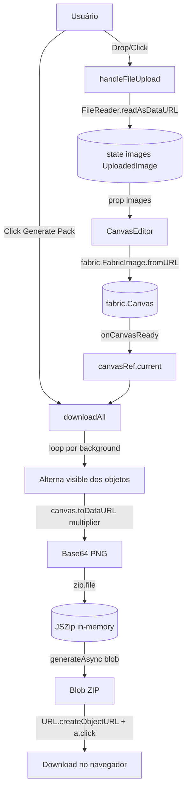
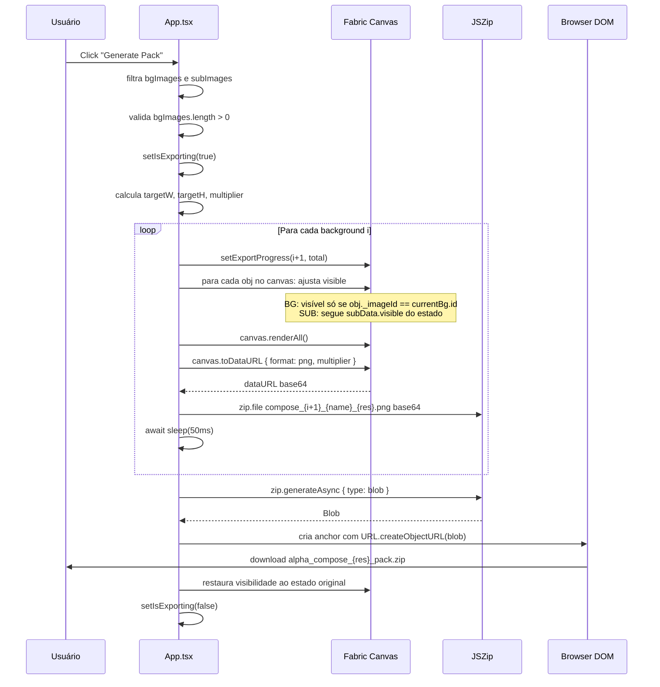

# 🔍 Auditoria Técnica — Alpha Compose

> **Projeto:** Alpha Compose — Precision Image Orchestrator
> **Versão analisada:** `0.1.1`
> **Data da auditoria:** 26/05/2026
> **Escopo:** Código-fonte completo (frontend + pipeline de geração do ZIP)
> **Idioma do relatório:** Português Brasileiro (pt-BR)

---

## 📌 Sumário Executivo

O **Alpha Compose** é uma aplicação **100% client-side** (sem backend) construída em **React 19 + TypeScript 5.8 + Vite 6**, cujo objetivo central é permitir a **composição de imagens em camadas** (subjects sobre backgrounds) e gerar **lotes de exportação em ZIP** com resoluções escaláveis até 4K.

**Não existe servidor**, ou seja, o "back-end" referido na pergunta é, na prática, o **pipeline JavaScript executado no navegador** — composto por três engines:

1. **[Fabric.js 7](http://fabricjs.com)** → engine gráfico de canvas (manipulação de objetos, escala, posicionamento, render).
2. **[JSZip 3](https://stuk.github.io/jszip/)** → empacotamento dos PNGs em um único `.zip` em memória.
3. **API nativa do navegador** → `canvas.toDataURL`, `URL.createObjectURL`, `<a download>` para entregar o arquivo.

A regra de negócio é **simples e elegante**: para cada `background` cadastrado, o canvas é renderizado uma vez com **apenas aquele fundo visível** + **todos os subjects marcados como `visible`**, e o resultado em PNG é adicionado ao ZIP final. O nome de saída segue o padrão `alpha_compose_{1K|2K|4K}_pack.zip`.

A auditoria identificou **boa qualidade arquitetural** (separação de responsabilidades, tipos fortes, hooks bem usados), porém detectou **bugs críticos**, **riscos de memória/performance**, **falta de validações** e **oportunidades de UX/i18n** documentados em detalhe nas seções abaixo.

---

## 🏛️ Arquitetura Geral

### Stack confirmada

| Camada | Tecnologia | Onde |
|---|---|---|
| Bundler | Vite 6 | [`vite.config.ts`](vite.config.ts:1) |
| UI | React 19 + Tailwind CSS 4 | [`src/App.tsx`](src/App.tsx:1), [`src/index.css`](src/index.css:1) |
| Tipagem | TypeScript 5.8 (strict OFF) | [`tsconfig.json`](tsconfig.json:1) |
| Canvas | Fabric.js 7.3.1 | [`src/components/CanvasEditor.tsx`](src/components/CanvasEditor.tsx:1) |
| Empacotamento | JSZip 3.10.1 | [`src/App.tsx`](src/App.tsx:29) |
| Animação | Motion (Framer) 12 | [`src/App.tsx`](src/App.tsx:19) |
| Ícones | Lucide React | [`src/App.tsx`](src/App.tsx:7) |

### Estrutura de pastas

```
Alpha-Compose/
├── index.html                 → bootstrap HTML
├── src/
│   ├── main.tsx               → React DOM entry (StrictMode)
│   ├── App.tsx                → contém TODAS as regras de negócio (upload, estado, export)
│   ├── types.ts               → tipos + tabelas ASPECT_RATIOS / RESOLUTIONS
│   ├── index.css              → Tailwind v4 + fontes Google
│   ├── lib/utils.ts           → helper cn() (clsx + tailwind-merge)
│   └── components/
│       └── CanvasEditor.tsx   → wrapper React do Fabric.js
```

### Diagrama de fluxo (alto nível)



---

## 🎯 Regras de Negócio do Frontend

### 1. Modelo de domínio — [`src/types.ts`](src/types.ts:1)

A entidade central é a interface [`UploadedImage`](src/types.ts:3):

```ts
interface UploadedImage {
  id: string;            // gerado: `img-${Date.now()}-${random}`
  url: string;           // dataURL base64 (lido do FileReader)
  name: string;          // nome original do arquivo
  width: number;         // px naturais da imagem
  height: number;        // px naturais
  role: 'background' | 'subject' | 'none';
  aspectRatio: number;   // width/height
  visible: boolean;      // controla render no canvas e no export
}
```

**Tabelas de domínio fixas** (`as const` em runtime):

- [`ASPECT_RATIOS`](src/types.ts:16): `'1:1' | '3:4' | '9:16' | '4:3' | '16:9'` (mapeado para razão decimal).
- [`RESOLUTIONS`](src/types.ts:26): `'1K' | '2K' | '4K'` → **total de pixels** (1MP, 4MP, 16MP).

> ⚠️ **Detalhe importante:** `RESOLUTIONS` armazena **pixels totais** (W×H), **não** dimensões fixas. Isso é coerente com a fórmula de exportação que recalcula W e H a partir da razão de aspecto.

### 2. Upload — [`handleFileUpload()`](src/App.tsx:43)

**Fluxo:**

1. Aceita tanto `<input type=file>` quanto **drag-and-drop** (`DataTransfer`).
2. **Limita a 20 imagens no total** (background + subject + none somados) com [`alert()`](src/App.tsx:52).
3. Para cada arquivo, lê via [`FileReader.readAsDataURL`](src/App.tsx:77) (gera **base64 inline**, sem `URL.createObjectURL`).
4. Decodifica via `new Image()` para extrair `width/height/aspectRatio`.
5. Atribui um `role` baseado no destino do drop (parâmetro `forcedRole`).

> 🐞 **Bug 1 (latente):** Se o usuário fizer **upload via input genérico** (sem `forcedRole`), a imagem entra com `role: 'none'`, **e como o `Section` só renderiza imagens já filtradas por role**, ela ficaria órfã na UI. Atualmente todos os inputs visíveis no JSX **passam `role`**, então o caminho `'none'` é morto na prática — porém a função `handleFileUpload` está pronta para esse caso, criando inconsistência de design.

### 3. Estado e ações no React — [`App.tsx`](src/App.tsx:34)

Estado mantido via `useState`:

| Estado | Tipo | Propósito |
|---|---|---|
| `images` | `UploadedImage[]` | Fonte única da verdade de todas as imagens |
| `aspectRatio` | `AspectRatioType` | Ratio escolhido (afeta canvas + export) |
| `exportRes` | `ExportResolution` | Qualidade selecionada (1K/2K/4K) |
| `isExporting` | `boolean` | Bloqueia botão e mostra spinner |
| `exportProgress` | `{current,total}` | Contador exibido no header |
| `canvasRef` | `useRef<fabric.Canvas>` | Referência ao canvas Fabric exposta pelo filho |

**Ações de manipulação:**

- [`removeImage(id)`](src/App.tsx:85) — remove do array.
- [`toggleVisibility(id)`](src/App.tsx:89) — alterna `visible` (afeta render e export).
- [`moveImage(id)`](src/App.tsx:93) — alterna `role` entre `background` ↔ `subject`. **Não permite voltar para `none`**.

### 4. Layout/UX — [`App.tsx`](src/App.tsx:273)

A interface é dividida em **3 colunas** + header + footer:

- **Sidebar esquerda (300px):** dois `Section` empilhados verticalmente: **Subjects** (roxo) e **Backgrounds** (azul). Cada um aceita drag-and-drop com `forcedRole`.
- **Main central:** header com seletor de aspect ratio + indicador de progresso; canvas centralizado; rodapé decorativo.
- **Sidebar direita (300px):** instruções, seletor de qualidade (1K/2K/4K) e botão "Generate Pack".

> 💄 **UI:** estilo **dark techno** com Tailwind v4, animações via Motion, efeitos de blur/glow. Toda a copy está em **inglês**, sem i18n.

---

## 🎨 Engine de Canvas — [`CanvasEditor.tsx`](src/components/CanvasEditor.tsx:1)

### Inicialização

No `useEffect` principal ([linha 19](src/components/CanvasEditor.tsx:19)):

1. Cria [`new fabric.Canvas(...)`](src/components/CanvasEditor.tsx:22) com `preserveObjectStacking: true` (mantém ordem de Z).
2. Expõe a referência via `onCanvasReady(canvas)`.
3. Define **handler de resize** que recalcula dimensões respeitando aspect ratio + 100px de padding e usa `Math.max(canvasW/imgW, canvasH/imgH)` (estilo `background-cover`).
4. **Cleanup chama [`canvas.dispose()`](src/components/CanvasEditor.tsx:81)**.

> ⚠️ **Risco:** o effect só roda quando `aspectRatio` muda ([linha 83](src/components/CanvasEditor.tsx:83)). Como o `images` está sendo lido dentro do callback de `resizeCanvas` mas **não está nas deps**, ocorre **closure stale** — o resize só "vê" as imagens existentes no momento em que o aspect ratio mudou. Em workflow real isso quase nunca quebra, mas é uma **violação das regras de hooks**.

### Sincronização imagens ↔ objetos Fabric

Segundo `useEffect` ([linha 86](src/components/CanvasEditor.tsx:86)) reage a mudanças no array `images`:

1. **Diff:** remove de `objectsRef` (Map) os IDs que sumiram do prop.
2. **Adiciona novos:** carrega via [`fabric.FabricImage.fromURL`](src/components/CanvasEditor.tsx:108) com `crossOrigin: 'anonymous'`.
3. **Marca metadados** custom no objeto Fabric:
   - `(fabricImg as any)._imageId = img.id`
   - `(fabricImg as any)._imageRole = img.role`
4. **Aplica heurísticas de posicionamento por role:**
   - **Background:** scale = `max(canvasW/imgW, canvasH/imgH)` (cover) + `insertAt(0, ...)` (vai para o fundo).
   - **Subject:** scale = `min(canvasW/imgW, canvasH/imgH) * 0.5` (caber na metade) + adiciona normalmente.
5. **Atualiza objetos existentes:** seta `visible` e re-aplica Z-order via `sendObjectToBack` / `bringObjectToFront`.

> 🐞 **Bug 2 (importante):** Quando uma imagem **muda de role** via [`moveImage`](src/App.tsx:93), o objeto **não** é recriado nem reescalonado — apenas o `_imageRole` é trocado e o Z-order ajustado. Resultado: um background convertido em subject pode **continuar gigante** (com a escala "cover") e atravessar o canvas.

> 🐞 **Bug 3 (cosmético/CSS):** [linha 174](src/components/CanvasEditor.tsx:174) — classe `-track-x-1/2` está com **typo** (deveria ser `-translate-x-1/2`). O alinhamento dos pontinhos decorativos está quebrado.

> ⚠️ **Risco de race condition:** carregar imagens via `await fabric.FabricImage.fromURL` dentro de um `for...of`. Se o usuário disparar várias mudanças no array `images` em sequência, dois `syncImages()` podem rodar simultaneamente e **adicionar duplicatas** ao canvas (não há AbortController nem flag de "loading").

> ⚠️ **Memory leak potencial:** quando o `aspectRatio` muda, o `useEffect` principal **descarta o canvas** (`canvas.dispose()`) mas o `objectsRef.current` **não é limpo**, e o segundo effect (sync) tentará usar um canvas antigo na primeira renderização seguinte (apesar de `fabricCanvasRef.current` estar atualizado, o Map mantém referências a objetos descartados). Em ratios sucessivos, isso pode acumular handles.

---

## 📦 Pipeline de Exportação ZIP

> Esta é a **regra de negócio mais crítica** do sistema, concentrada em [`downloadAll()`](src/App.tsx:102) (88 linhas).

### Fluxo passo a passo



### Cálculo da resolução de saída

Trecho-chave em [`App.tsx`](src/App.tsx:120):

```ts
const totalPixels = RESOLUTIONS[res];      // 1MP, 4MP ou 16MP
const arValue    = ASPECT_RATIOS[aspectRatio]; // ex.: 16/9 ≈ 1.7777
const targetHeight = Math.sqrt(totalPixels / arValue);
const targetWidth  = targetHeight * arValue;
const multiplier   = targetWidth / canvas.width;
```

**Justificativa:** dado que `W*H = totalPixels` e `W/H = AR`, então `H = √(totalPixels/AR)` e `W = H*AR`. O `multiplier` aplicado a [`canvas.toDataURL({ multiplier })`](src/App.tsx:155) faz o Fabric **re-renderizar em alta resolução** sem precisar redimensionar o canvas visível.

> ✅ **Ponto positivo:** abordagem matematicamente correta e eficiente — render em alta-res por demanda em vez de manter um canvas gigante na tela.

> ⚠️ **Limitação:** o multiplier é único por export. Se algum subject for de baixa resolução (ex.: 200×200) e o multiplier for 4×, o resultado terá **aliasing/borrado** porque o Fabric apenas escala o pixmap original.

### Algoritmo de toggle de visibilidade

Para cada background da lista, o loop em [linha 134](src/App.tsx:134):

1. **Apaga todos os outros backgrounds** do canvas (deixa só o atual visível).
2. **Mantém os subjects** que o usuário marcou como `visible: true`.
3. Renderiza, exporta para PNG base64, adiciona ao ZIP.
4. Aguarda **50ms** ([linha 165](src/App.tsx:165)) com `setTimeout` — único propósito é dar **chance ao React de atualizar o contador** `1 / N`.
5. Ao final, **restaura a visibilidade original** ([linha 175](src/App.tsx:175)) usando o estado React `images`.

### Convenção de nomes

- **PNG dentro do ZIP:** `compose_{index+1}_{nomeOriginalSemExtensão}_{1K|2K|4K}.png`
  - Sanitização atual: `currentBg.name.replace(/\.[^/.]+$/, "")` ([linha 161](src/App.tsx:161)).
- **ZIP final:** `alpha_compose_{1K|2K|4K}_pack.zip`.

> 🐞 **Bug 4 (segurança/portabilidade):** o `safeName` **não remove caracteres ilegais** (`/`, `\`, `:`, `*`, `?`, `"`, `<`, `>`, `|`). Se o usuário fizer upload de `foto/recente.png`, o ZIP poderá conter caminhos inválidos no Windows. Recomenda-se um `replace(/[<>:"/\\|?*\x00-\x1F]/g, '_')`.

> 🐞 **Bug 5 (memória):** [`URL.createObjectURL(content)`](src/App.tsx:170) **nunca é revogado**. Em sessões longas, vazamento de memória do tamanho do ZIP por exportação. Solução: `URL.revokeObjectURL(link.href)` após `link.click()`.

> 🐞 **Bug 6 (UX/perda de dados):** `dataUrl.split(',')[1]` ([linha 160](src/App.tsx:160)) é seguro só porque `format: 'png'` sempre retorna `data:image/png;base64,...`. Não há tratamento de fallback caso retorne string vazia. Para exports de **alta resolução em 4K (16MP)**, há risco real de **OOM** em dispositivos modestos — neste caso, `toDataURL` retorna `""` ou lança exceção, e o `.split(',')[1]` resulta em `undefined`, gerando arquivo PNG corrompido no ZIP.

> 🐞 **Bug 7 (performance):** acumular **dezenas de PNGs em memória como base64** dentro do JSZip antes de gerar o blob é extremamente custoso. 20 backgrounds × 16MP em 4K ≈ **dezenas de MB em base64 inflado em ~33%**. O ideal seria usar `dataUrl.split(',')[1]` decodificado para `Uint8Array` (binário puro) ou a API `canvas.toBlob()` em conjunto com `zip.file(name, blob)`.

> ⚠️ **Risco de DX:** o tratamento de erro é genérico (`alert('Export failed.')`) — no console apenas `console.error(err)`. Em produção, é difícil diagnosticar por que falhou.

---

## 🐞 Achados — Tabela Consolidada

| # | Severidade | Componente | Achado | Linha(s) |
|---|---|---|---|---|
| 1 | 🟡 Médio | [`App.tsx`](src/App.tsx:43) | Caminho `role: 'none'` é morto mas existe na função | [71](src/App.tsx:71) |
| 2 | 🔴 Alto | [`CanvasEditor.tsx`](src/components/CanvasEditor.tsx:148) | `moveImage()` não reescalona objeto; background virando subject fica gigante | [149-157](src/components/CanvasEditor.tsx:149) |
| 3 | 🟢 Baixo | [`CanvasEditor.tsx`](src/components/CanvasEditor.tsx:174) | Typo CSS `-track-x-1/2` em vez de `-translate-x-1/2` | [174](src/components/CanvasEditor.tsx:174) |
| 4 | 🟡 Médio | [`App.tsx`](src/App.tsx:161) | `safeName` não remove caracteres inválidos para nome de arquivo | [161](src/App.tsx:161) |
| 5 | 🟡 Médio | [`App.tsx`](src/App.tsx:170) | `URL.createObjectURL` nunca é revogado (memory leak) | [170](src/App.tsx:170) |
| 6 | 🔴 Alto | [`App.tsx`](src/App.tsx:160) | `toDataURL` em 4K pode lançar/retornar vazio sem fallback | [155-162](src/App.tsx:155) |
| 7 | 🔴 Alto | [`App.tsx`](src/App.tsx:117) | Acumular base64 em RAM antes do ZIP é caro; usar `toBlob` direto | [117-167](src/App.tsx:117) |
| 8 | 🟡 Médio | [`CanvasEditor.tsx`](src/components/CanvasEditor.tsx:83) | Effect com `[aspectRatio]` ignora `images` (closure stale) | [83](src/components/CanvasEditor.tsx:83) |
| 9 | 🟡 Médio | [`CanvasEditor.tsx`](src/components/CanvasEditor.tsx:90) | `syncImages` async sem AbortController — possível duplicação | [90-160](src/components/CanvasEditor.tsx:90) |
| 10 | 🟡 Médio | [`App.tsx`](src/App.tsx:51) | Limite de 20 imagens via `alert()` (UX pobre, sem i18n) | [51-54](src/App.tsx:51) |
| 11 | 🟢 Baixo | [`App.tsx`](src/App.tsx:191) | Componente `Section` declarado dentro de `App` (recriado a cada render) | [191](src/App.tsx:191) |
| 12 | 🟡 Médio | [`tsconfig.json`](tsconfig.json:1) | Sem `strict: true`; uso intenso de `as any` em metadados Fabric | [1-26](tsconfig.json:1) |
| 13 | 🟢 Baixo | [`App.tsx`](src/App.tsx:34) | Toda a regra de negócio mora em `App.tsx` (402 linhas) — falta separação | [34-402](src/App.tsx:34) |
| 14 | 🟡 Médio | UX | Não há feedback visual quando export é cancelado/falha (só `alert`) | [183-184](src/App.tsx:183) |
| 15 | 🟢 Baixo | [`App.tsx`](src/App.tsx:165) | `setTimeout(50ms)` é heurística frágil para forçar paint do contador | [165](src/App.tsx:165) |
| 16 | 🟡 Médio | Acessibilidade | Botões sem `aria-label`, sem foco estilizado, sem `role` correto | global |
| 17 | 🟡 Médio | Validação | Aceita `accept="image/*"` mas não valida se PNG do subject **realmente** tem alpha | [266](src/App.tsx:266) |

**Legenda:** 🔴 Alto · 🟡 Médio · 🟢 Baixo

---

## ✅ Pontos Positivos

- **Arquitetura cliente-only é coerente com a proposta** (privacidade, zero infra).
- **Tipagem forte em domínio** (`UploadedImage`, `AspectRatioType`, `ExportResolution`) com tabelas constantes em [`types.ts`](src/types.ts:1).
- **Cálculo do multiplier baseado em pixel-budget** é matematicamente elegante e flexível.
- **Uso correto de `preserveObjectStacking`** + `sendObjectToBack` / `bringObjectToFront`.
- **Padrão de metadados custom** (`_imageId`, `_imageRole`) em objetos Fabric facilita o filtro durante o export.
- **Cleanup parcial:** `canvas.dispose()` e `removeEventListener('resize')` no unmount.
- **Restauração de estado pós-export:** as visibilidades são revertidas corretamente após o download.

---

## 🛠️ Recomendações (priorizadas)

### Críticas (bloquear release antes de resolver)

1. **Migrar pipeline de export para `canvas.toBlob`** → JSZip aceita blob direto, evitando inflar base64 em memória. Reduz ~33% de RAM e é mais robusto em 4K.
2. **Tratar falha de `toDataURL/toBlob`** em alta resolução com try/catch dedicado e fallback para resolução menor.
3. **Reescalonar objeto Fabric** quando o `role` muda em [`moveImage`](src/App.tsx:93) — chamar uma função `applyRoleDefaults(obj, role)` no `CanvasEditor`.

### Importantes (próxima sprint)

4. **`URL.revokeObjectURL`** após `link.click()` para liberar memória do blob ZIP.
5. **Sanitizar `safeName`** com regex `[<>:"/\\|?*\x00-\x1F]` → `_`.
6. **Substituir `alert()`** por toasts (a aplicação já tem Motion instalado — adicionar `sonner` ou semelhante).
7. **Habilitar `strict: true`** no [`tsconfig.json`](tsconfig.json:1) e tipar metadados Fabric via `declare module 'fabric'` em vez de `as any`.
8. **Mover `Section`** para fora do `App` (componente próprio em `src/components/Section.tsx`).
9. **Quebrar `App.tsx`** em módulos: `useImages`, `useExporter`, `Header`, `Sidebar`, `WorkflowPanel`.

### Desejáveis (backlog)

10. **AbortController** em `syncImages` para evitar race quando `images` muda rápido.
11. **Acessibilidade:** `aria-label` em todos os botões-ícone, foco visível, suporte a teclado.
12. **i18n:** adicionar `react-i18next` ou estrutura simples de dicionário pt-BR/en-US.
13. **Validação real de PNG-com-alpha** para subjects (verificar `image/png` MIME e canal alfa via canvas auxiliar).
14. **Persistência opcional** via `IndexedDB` para o usuário recuperar a sessão ao recarregar a aba.
15. **Worker offthread:** rodar `toBlob` + `JSZip.generateAsync` em um Web Worker para não congelar a UI em packs grandes.
16. **Indicador de tamanho estimado do ZIP** antes de iniciar o download (preview de quantos PNGs serão gerados).
17. **Cancelamento do export** (botão "Cancel" durante a geração).

---

## 📊 Métricas de Código

| Arquivo | Linhas | Responsabilidade | Coesão |
|---|---:|---|:---:|
| [`src/App.tsx`](src/App.tsx:1) | **402** | Estado global, upload, sidebar, header, export | 🟡 |
| [`src/components/CanvasEditor.tsx`](src/components/CanvasEditor.tsx:1) | **181** | Wrapper Fabric.js, sync, resize | 🟢 |
| [`src/types.ts`](src/types.ts:1) | 31 | Tipos + tabelas | 🟢 |
| [`src/lib/utils.ts`](src/lib/utils.ts:1) | 6 | Helper `cn()` | 🟢 |
| [`src/main.tsx`](src/main.tsx:1) | 11 | Bootstrap | 🟢 |

> A coesão de [`App.tsx`](src/App.tsx:1) está classificada como 🟡 porque concentra **UI + estado + regras de exportação** em um único arquivo de 400+ linhas.

---

## 🧭 Conclusão

O **Alpha Compose** é uma aplicação **conceitualmente bem desenhada** que entrega a proposta de "componer e empacotar imagens no navegador" com **boa fluidez de UX** e **sem dependência de servidor**. A escolha de Fabric.js + JSZip é apropriada e o cálculo do multiplier por pixel-budget é uma **abstração elegante**.

Entretanto, a fase de **exportação em ZIP** — coração da aplicação — possui **três fragilidades sérias** que podem comprometer a confiabilidade em cenários reais (4K + muitos backgrounds): **gestão de memória via base64**, **ausência de fallback** quando `toDataURL` falha, e **vazamento de URL.createObjectURL**. Há também um **bug funcional perceptível** ao mover imagens entre seções sem reescalonar.

Recomenda-se priorizar as **3 ações críticas** (toBlob + try/catch robusto + reescalonamento em `moveImage`) antes de qualquer release voltado a usuários finais. As demais recomendações endereçam dívida técnica, acessibilidade e UX e podem ser distribuídas em iterações subsequentes.

---

> **Auditor:** Agent Architect (Roo)
> **Repositório:** [Alpha-Compose](https://github.com/vandre-sales/Alpha-Compose)
> **Tipo de auditoria:** Estática (leitura de código) — não inclui testes dinâmicos nem profiling em runtime.
