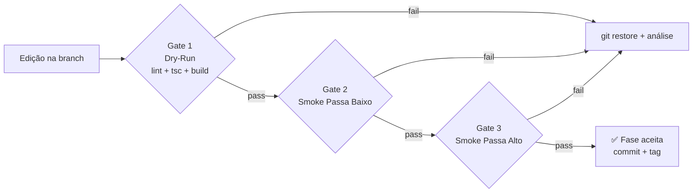
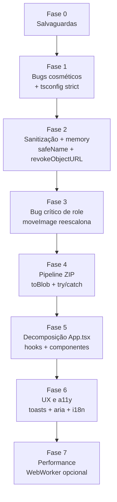
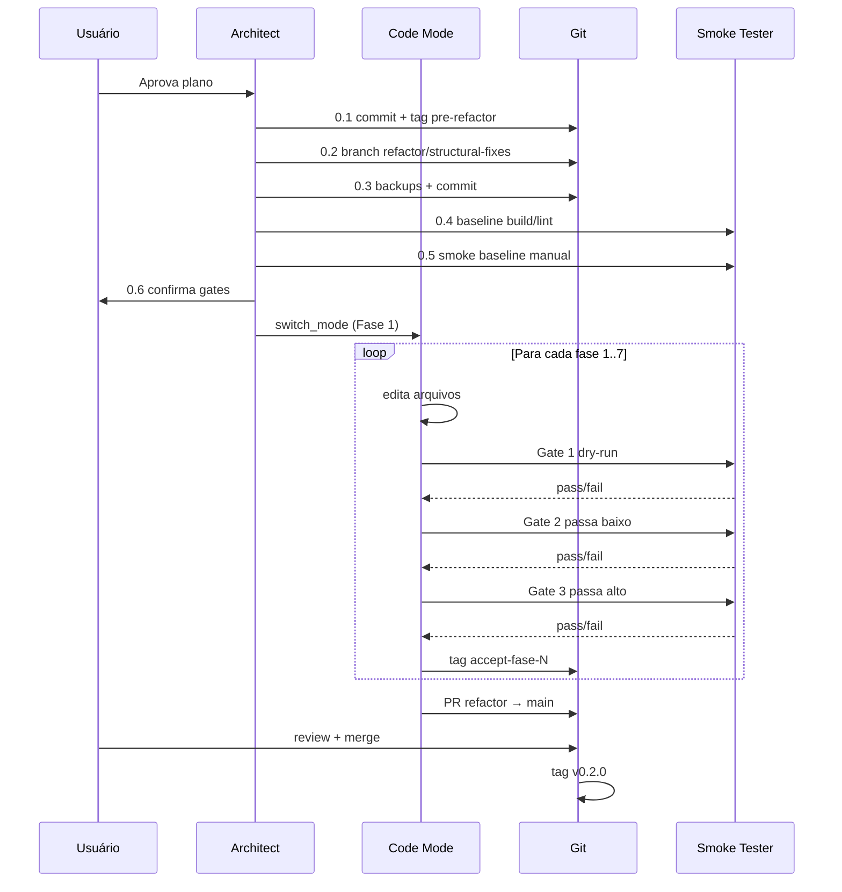

# 🛠️ Plano de Refatoração — Alpha Compose

> **Documento:** Plano de Refatoração Estrutural
> **Projeto:** Alpha Compose `v0.1.1`
> **Auditoria-base:** [`plans/auditoria-alpha-compose.md`](auditoria-alpha-compose.md:1)
> **Data:** 26/05/2026
> **Idioma:** Português Brasileiro (pt-BR)
> **Princípio reitor:** **Zero alteração de código antes da execução completa das salvaguardas e validação dos gates.**

---

## 🧭 Princípios Inegociáveis

1. **Nada é executado sem commit de segurança prévio.**
2. **Todo arquivo a ser modificado terá um snapshot `.bak` versionado em [`backups/`](backups:1)** antes da primeira edição.
3. **Toda fase passa por *dry-run* (linter + typecheck + build) antes de ser aceita.**
4. **Toda fase passa por *smoke test passa baixo* e *passa alto* antes de seguir adiante.**
5. **Feature flags ou branches isoladas** — nenhuma alteração estrutural na `main` direto.
6. **Reversibilidade total:** todo passo deve ter um caminho de rollback documentado e testado.

---

## 🛡️ FASE 0 — Salvaguardas (Pré-Refatoração)

> ⛔ **Bloqueio absoluto:** nenhum código pode ser tocado antes que **todos os 6 itens** desta fase estejam ✅.

### 0.1 — Commit de Segurança (snapshot da `main`)

```bash
# Verificar estado limpo
git status
git diff --stat

# Caso haja alterações pendentes, decidir: stash ou commit
git add -A
git commit -m "chore(audit): snapshot pré-refatoração — auditoria registrada em /plans"

# Tag imutável de segurança
git tag -a pre-refactor-v0.1.1 -m "Estado-base antes da refatoração estrutural"
git push origin main --tags
```

**Saída esperada:**
- ✅ `git log --oneline -1` mostra o commit do snapshot.
- ✅ `git tag -l pre-refactor-v0.1.1` retorna a tag.
- ✅ Push remoto confirmado (origin atualizado).

**Rollback:**
```bash
git reset --hard pre-refactor-v0.1.1
```

---

### 0.2 — Branch Isolada de Refatoração

```bash
git switch -c refactor/structural-fixes
```

> Toda mudança ocorre nesta branch. **Merge para `main` somente após smoke test passa alto OK.**

---

### 0.3 — Cópia de Backup dos Arquivos Alvo

Criar diretório [`backups/`](backups:1) (adicionar a [`.gitignore`](.gitignore:1) **não** — queremos rastreabilidade) e copiar os arquivos que serão tocados:

```bash
mkdir -p backups/$(date +%Y%m%d-%H%M)
DEST="backups/$(date +%Y%m%d-%H%M)"
cp src/App.tsx                       "$DEST/App.tsx.bak"
cp src/types.ts                      "$DEST/types.ts.bak"
cp src/components/CanvasEditor.tsx   "$DEST/CanvasEditor.tsx.bak"
cp src/index.css                     "$DEST/index.css.bak"
cp tsconfig.json                     "$DEST/tsconfig.json.bak"
cp package.json                      "$DEST/package.json.bak"
cp vite.config.ts                    "$DEST/vite.config.ts.bak"
git add backups/
git commit -m "chore(backup): snapshot dos arquivos alvo da refatoração"
```

**Por que `backups/` versionado?**
- Recuperação direta via `git show` em qualquer momento.
- Auditoria histórica de "como estava antes".
- Fonte secundária caso a branch seja deletada acidentalmente.

---

### 0.4 — Baseline de Saúde (Dry-Run inicial)

Antes de qualquer edição, executar e **registrar** os baselines:

```bash
# 1. Lint / typecheck
npm run lint > backups/$DEST/baseline-lint.log 2>&1

# 2. Build de produção
npm run build > backups/$DEST/baseline-build.log 2>&1

# 3. Tamanho do bundle
du -sh dist/ > backups/$DEST/baseline-size.txt

# 4. Hash do dist
find dist -type f -exec sha256sum {} \; | sort > backups/$DEST/baseline-dist.sha256

git add backups/
git commit -m "chore(baseline): registro do estado de build pré-refatoração"
```

**Critério de gate 0.4:**
- ✅ `npm run lint` termina com **exit code 0**.
- ✅ `npm run build` termina com **exit code 0** e gera [`dist/`](dist:1).
- ✅ Tamanho de bundle e hashes registrados como referência.

---

### 0.5 — Smoke Test Manual de Baseline (Passa Baixo)

Executar [`npm run dev`](package.json:21) e validar **manualmente** o fluxo crítico **antes** de qualquer mudança:

| # | Ação | Resultado esperado |
|:-:|---|---|
| 1 | Carregar `http://localhost:3000` | App monta sem erros no console |
| 2 | Drop 1 PNG na seção **Subjects** | Card aparece, miniatura visível |
| 3 | Drop 1 JPG na seção **Backgrounds** | Card aparece, canvas exibe BG |
| 4 | Trocar aspect ratio para `16:9` | Canvas redimensiona corretamente |
| 5 | Selecionar resolução **1K** | Botão "Generate Pack" habilita |
| 6 | Click em **Generate Pack** | ZIP `alpha_compose_1K_pack.zip` baixa |
| 7 | Abrir ZIP e inspecionar PNG | Imagem composta correta, 1MP aprox |

**Registrar:** print da tela final + tamanho do ZIP em [`backups/$DEST/smoke-baseline.md`](backups:1).

> 🚫 **Bloqueio:** se qualquer passo falhar, **a refatoração não inicia**. O bug deve ser registrado e o baseline atualizado.

---

### 0.6 — Definição dos Gates de Aprovação por Fase

Cada fase de refatoração só é considerada **aceita** quando passa por **3 gates sequenciais**:



#### Gate 1 — Dry-Run (automatizado)

```bash
npm run lint && npm run build
```

- **Critério:** ambos com exit 0; nenhum warning novo em relação ao baseline.

#### Gate 2 — Smoke Test Passa Baixo (manual, fluxo mínimo)

> **Objetivo:** validar que o fluxo essencial (1 BG + 1 SUB + 1K + 1:1) **continua funcional** após a mudança.

| # | Cenário | Critério |
|:-:|---|---|
| L1 | Upload de 1 SUB + 1 BG | Cards renderizam |
| L2 | Toggle visibilidade do SUB | Canvas reflete instantaneamente |
| L3 | Generate Pack em 1K, 1:1 | ZIP gerado com 1 PNG válido |
| L4 | Inspecionar console | Sem erros novos |

#### Gate 3 — Smoke Test Passa Alto (manual, carga máxima)

> **Objetivo:** validar resiliência sob carga e em todos os caminhos críticos da fase.

| # | Cenário | Critério |
|:-:|---|---|
| H1 | 5 SUB + 5 BG + 4K + 16:9 | Pack 5 PNGs gerado sem OOM/erros |
| H2 | Mover imagem entre seções 3× | Escala correta após move (Bug 2) |
| H3 | Cancelar e re-gerar pack | Sem leak de memória aparente (DevTools Memory) |
| H4 | Upload 21 imagens | Mensagem de limite (não-`alert`, se já refatorado) |
| H5 | Nome com `/` e `\` | ZIP abre sem caminhos inválidos |
| H6 | DevTools → Performance recording durante export | FPS não cai a zero por > 500ms |

**Registrar resultado de cada Gate** em [`backups/$DEST/gates-fase-{N}.md`](backups:1).

---

## 🚦 Resumo da Fase 0 (Checklist Bloqueante)

```
[ ] 0.1 Commit + tag pre-refactor-v0.1.1 + push
[ ] 0.2 Branch refactor/structural-fixes criada
[ ] 0.3 backups/ com .bak dos 7 arquivos + commit
[ ] 0.4 Baseline lint/build/size/sha256 registrado
[ ] 0.5 Smoke baseline manual executado e documentado
[ ] 0.6 Gates de aprovação definidos e comunicados
```

> Apenas com **6 ✅** a Fase 1 é liberada.

---

## 📐 Estratégia de Refatoração

### Ordem das fases (do menos ao mais arriscado)



Cada fase tem: **escopo · arquivos · critério de aceite · plano de rollback**.

---

## 🧱 FASE 1 — Estabilização Cosmética + Tipagem Strict

**Severidade abordada:** 🟢 Baixos #3, #11 + 🟡 #12.

### Escopo
- Corrigir typo CSS [`-track-x-1/2`](src/components/CanvasEditor.tsx:174) → `-translate-x-1/2`.
- Mover componente `Section` de dentro de [`App`](src/App.tsx:191) para [`src/components/Section.tsx`](src/components/Section.tsx:1).
- Habilitar `"strict": true` em [`tsconfig.json`](tsconfig.json:1) e ajustar **apenas** os erros que isso revelar (sem refatoração de lógica).
- Tipar metadados Fabric via [`src/types/fabric-augment.d.ts`](src/types/fabric-augment.d.ts:1) substituindo `as any`.

### Arquivos tocados
- [`src/components/CanvasEditor.tsx`](src/components/CanvasEditor.tsx:1) (typo + remoção de `as any`)
- [`src/App.tsx`](src/App.tsx:1) (extrair Section + remoção de `as any`)
- [`src/components/Section.tsx`](src/components/Section.tsx:1) (novo)
- [`src/types/fabric-augment.d.ts`](src/types/fabric-augment.d.ts:1) (novo)
- [`tsconfig.json`](tsconfig.json:1)

### Critério de aceite
- ✅ Gate 1 passa.
- ✅ Gate 2 (passa baixo) passa.
- ✅ Gate 3 (passa alto) passa.
- ✅ Zero ocorrências de `as any` na base.
- ✅ Componente `Section` extraído e importado.

### Rollback
```bash
git restore --source=pre-refactor-v0.1.1 -- \
  src/App.tsx src/components/CanvasEditor.tsx tsconfig.json
rm -f src/components/Section.tsx src/types/fabric-augment.d.ts
```

---

## 🧹 FASE 2 — Sanitização e Memória

**Severidade abordada:** 🟡 #4, #5.

### Escopo
- Implementar [`sanitizeFilename()`](src/lib/utils.ts:1) em [`src/lib/utils.ts`](src/lib/utils.ts:1) com regex `[<>:"/\\|?*\x00-\x1F]` → `_`.
- Aplicar em [`App.tsx`](src/App.tsx:161) substituindo o `replace` simples.
- Adicionar [`URL.revokeObjectURL(link.href)`](src/App.tsx:170) após `link.click()` (com `setTimeout(0)` ou no próximo tick).

### Arquivos tocados
- [`src/lib/utils.ts`](src/lib/utils.ts:1)
- [`src/App.tsx`](src/App.tsx:1)

### Critério de aceite
- ✅ Gates 1, 2, 3.
- ✅ Smoke H5 (nome com `/` e `\`) passa.
- ✅ DevTools → Memory snapshot após 5 exports não cresce indefinidamente.

### Rollback
`git restore` dos 2 arquivos.

---

## 🐞 FASE 3 — Bug Crítico de Mudança de Papel

**Severidade abordada:** 🔴 #2.

### Escopo
Refatorar [`syncImages()`](src/components/CanvasEditor.tsx:90) para detectar **mudança de role** entre ciclos:
- Quando `objectsRef.current.get(id)._imageRole !== img.role`, **reaplicar defaults** (escala + posição) via função extraída `applyRoleDefaults(obj, img, canvas)`.
- Manter posição customizada do usuário **somente** se não houver mudança de role.

### Arquivos tocados
- [`src/components/CanvasEditor.tsx`](src/components/CanvasEditor.tsx:1)

### Critério de aceite
- ✅ Gates 1, 2, 3.
- ✅ Smoke H2 valida o cenário: subir BG, clicar Move, verificar que a imagem fica em escala de subject.

### Rollback
`git restore src/components/CanvasEditor.tsx`.

---

## 📦 FASE 4 — Pipeline de Exportação Robusto

**Severidade abordada:** 🔴 #6, #7.

### Escopo (núcleo desta refatoração)
1. **Substituir `canvas.toDataURL` por `canvas.toCanvasElement(multiplier)` + `canvasEl.toBlob('image/png')`** — entrega `Blob` direto, sem inflar base64.
2. **Adicionar try/catch dedicado por iteração**, com **fallback de qualidade** (4K → 2K → 1K) caso `toBlob` retorne `null`.
3. Usar [`zip.file(name, blob)`](src/App.tsx:162) (JSZip aceita Blob nativamente).
4. **Detectar OOM antecipado:** se `multiplier * canvas.width > 16384` (limite de canvas em maioria dos browsers), abortar com mensagem amigável.
5. **Substituir `setTimeout(50)` por `await new Promise(r => requestAnimationFrame(() => r(null)))`** — duas rAF para garantir paint.
6. **Erros não-`alert`:** usar console + estado `exportError: string | null` exibido na UI (toast vem em fase 6).

### Arquivos tocados
- [`src/App.tsx`](src/App.tsx:1) (função [`downloadAll()`](src/App.tsx:102))
- (eventualmente extrair para [`src/lib/exporter.ts`](src/lib/exporter.ts:1) — decisão na fase 5)

### Critério de aceite
- ✅ Gates 1, 2, 3.
- ✅ Smoke H1 (5×5 + 4K + 16:9) gera ZIP em **memória ≤ 50% do antigo** (medido via DevTools).
- ✅ Smoke H6 (Performance recording) sem stalls > 500ms.
- ✅ Forçar OOM artificial (canvas 30000×30000) → mensagem amigável, app não trava.

### Rollback
`git restore src/App.tsx`.

---

## 🧩 FASE 5 — Decomposição do `App.tsx`

**Severidade abordada:** 🟡 #13.

### Escopo
Quebrar [`App.tsx`](src/App.tsx:1) (402 linhas) em módulos coesos:

```
src/
├── App.tsx                       (← apenas composição: ~60 linhas)
├── hooks/
│   ├── useImageLibrary.ts        (estado images + actions)
│   ├── useExporter.ts            (downloadAll + progress + error)
│   └── useCanvasInstance.ts      (canvasRef + onCanvasReady)
├── lib/
│   ├── exporter.ts               (puro: gera blobs e zip a partir de canvas+images)
│   ├── filename.ts               (sanitize + nome final)
│   └── geometry.ts               (cálculo de multiplier)
├── components/
│   ├── Section.tsx               (já criado em F1)
│   ├── Header.tsx                (aspect ratio + progress)
│   ├── RightPanel.tsx            (workflow + quality + generate)
│   └── CanvasEditor.tsx          (existente)
```

### Critério de aceite
- ✅ Gates 1, 2, 3.
- ✅ Nenhuma regressão funcional.
- ✅ [`App.tsx`](src/App.tsx:1) reduzido para ≤ 100 linhas.
- ✅ Cada hook/lib testável isoladamente (preparação para fase de testes futura).

### Rollback
Reverter para tag de aceite da fase 4: `git restore --source=accept-fase-4 -- src/`.

---

## ♿ FASE 6 — UX, Acessibilidade e i18n

**Severidade abordada:** 🟡 #10, #14, #16; 🟢 #15.

### Escopo
- Substituir todos os `alert()` por **toasts** (adicionar dependência `sonner` ou implementar custom com Motion).
- Adicionar `aria-label`, `aria-live="polite"` no contador de progresso, `role="region"` nas Sections.
- Foco visível com Tailwind `focus-visible:ring-2`.
- Estrutura mínima de i18n: `src/i18n/{en,pt-BR}.ts` + hook `useT()` (sem dependência externa por ora).
- Botão **Cancel** durante export (aborta loop com flag).

### Arquivos tocados
- Múltiplos componentes da fase 5.
- [`package.json`](package.json:1) (nova dep opcional).
- [`src/i18n/`](src/i18n:1) (novo).

### Critério de aceite
- ✅ Gates 1, 2, 3.
- ✅ Audit Lighthouse a11y ≥ 95.
- ✅ Tab navega por todos os controles principais.
- ✅ Toggle de idioma funciona em pelo menos 1 string.

### Rollback
Branch isolada `refactor/ux-a11y` cherry-pick reversível.

---

## ⚡ FASE 7 — Performance Avançada (Opcional)

**Severidade abordada:** desejável #15 da auditoria.

### Escopo
- Mover `JSZip.generateAsync` + iteração `toBlob` para **Web Worker** ([`src/workers/exportWorker.ts`](src/workers/exportWorker.ts:1)).
- UI thread permanece responsiva durante export 4K.
- Comunicação via `postMessage` com mensagens tipadas.

### Critério de aceite
- ✅ Gates 1, 2, 3.
- ✅ FPS da UI ≥ 50 durante export 4K (medido em DevTools).
- ✅ Cancelamento via `worker.terminate()`.

### Rollback
Worker é opcional — pode ser desligado por feature flag `VITE_USE_WORKER=false`.

---

## 🧪 Matriz Consolidada de Smoke Tests

### Passa Baixo (executar após **toda** fase)

| Código | Cenário | Tempo aprox |
|:-:|---|:-:|
| L1 | Upload 1 SUB + 1 BG | 30s |
| L2 | Toggle visibilidade | 10s |
| L3 | Generate Pack 1K 1:1 | 20s |
| L4 | Console limpo | 5s |

### Passa Alto (executar após **toda** fase)

| Código | Cenário | Tempo aprox |
|:-:|---|:-:|
| H1 | 5 SUB + 5 BG + 4K + 16:9 | 2 min |
| H2 | Move 3× (verificar escala) | 1 min |
| H3 | 5 exports consecutivos + Memory snapshot | 5 min |
| H4 | Upload 21 imagens (limite) | 30s |
| H5 | Nome `foto/teste.png` (caracteres ilegais) | 30s |
| H6 | Performance recording 4K | 2 min |
| H7 (Fase 4+) | Forçar OOM (canvas 30000²) | 1 min |
| H8 (Fase 6+) | Cancelar export no meio | 1 min |
| H9 (Fase 7+) | FPS ≥ 50 durante export | 2 min |

---

## 📋 Sequência Final de Execução (Roteiro Operacional)



---

## 🚨 Política de Rollback

| Cenário | Comando |
|---|---|
| Falha em uma fase | `git restore --source=accept-fase-{N-1} -- src/` |
| Reverter tudo até pré-refator | `git switch main && git reset --hard pre-refactor-v0.1.1` |
| Deletar branch acidentalmente | Recuperar via `backups/` (snapshots .bak) |
| Build quebrado em prod | Re-deploy da tag `pre-refactor-v0.1.1` |

---

## 📦 Entregáveis Esperados ao Final

- [ ] Branch `refactor/structural-fixes` mergeada na `main` via PR.
- [ ] Tag `v0.2.0` (semver minor — sem breaking changes para o usuário final).
- [ ] [`backups/`](backups:1) com .bak + logs + snapshots de gates por fase.
- [ ] [`CHANGELOG.md`](CHANGELOG.md:1) novo na raiz documentando cada fase.
- [ ] [`README.md`](README.md:1) atualizado com nova estrutura de pastas.
- [ ] Auditoria-base ([`plans/auditoria-alpha-compose.md`](auditoria-alpha-compose.md:1)) com seção **"Resolução"** preenchida ao lado de cada bug.

---

## 🛑 Pré-Aprovação Necessária do Usuário

Antes de qualquer execução, o usuário deve **confirmar explicitamente**:

1. **Aceito o plano de fases 0 → 7?** (sim / sim com ajustes / não)
2. **Posso criar a tag `pre-refactor-v0.1.1` e a branch `refactor/structural-fixes`?**
3. **Posso versionar `backups/` no repositório?** (alternativa: armazenar fora do repo)
4. **Quem executa os smoke tests manuais?** (usuário / agente Code mode com instruções)
5. **Padrão de commit message?** (`conventional commits` é a sugestão padrão)
6. **Após aprovação, devo mudar para 💻 Code mode** para iniciar a Fase 0?

---

## 📚 Referências cruzadas

- Auditoria detalhada: [`plans/auditoria-alpha-compose.md`](auditoria-alpha-compose.md:1)
- Código-fonte alvo: [`src/App.tsx`](src/App.tsx:1) · [`src/components/CanvasEditor.tsx`](src/components/CanvasEditor.tsx:1) · [`src/types.ts`](src/types.ts:1)
- Configurações: [`tsconfig.json`](tsconfig.json:1) · [`vite.config.ts`](vite.config.ts:1) · [`package.json`](package.json:1)

---

> **Autor do plano:** Agent Architect (Roo)
> **Status:** 🟡 Aguardando aprovação do usuário antes de mudar para Code mode
> **Próxima ação esperada:** resposta às 6 perguntas de pré-aprovação acima.
