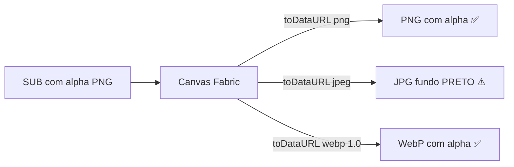
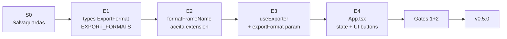

# 🎨 Sprint de Evolução — Formato de Exportação (PNG/JPG/WEBP)

> **Documento:** Dossier de Sprint — Multiple Export Formats
> **Projeto:** Alpha Compose `v0.4.0` → `v0.5.0`
> **Data:** 26/05/2026
> **Idioma:** Português Brasileiro (pt-BR)
> **Premissa:** v0.4.0 (Grid Mode) já em produção.

---

## 🎯 Objetivo da Sprint

Permitir ao usuário escolher entre **3 formatos de exportação** para os PNGs gerados no ZIP:

1. **PNG** — formato padrão atual (lossless, suporta alpha)
2. **JPG** — alta qualidade (quase-lossless, sem alpha, menor tamanho que PNG)
3. **WEBP** — formato moderno lossless (tamanho ~30% menor que PNG, suporta alpha)

Todos com **qualidade máxima** para evitar deterioração das imagens originais.

---

## 🔬 Análise Técnica dos Formatos

### Tabela comparativa

| Formato | Lossless? | Alpha | Tamanho típico | Compatibilidade | Browser API |
|:---:|:---:|:---:|:---:|:---:|:---:|
| **PNG** | ✅ Sim | ✅ Sim | 100% (referência) | 100% | `image/png` |
| **JPG** | ❌ Não | ❌ Não | 25-40% | 100% | `image/jpeg` + `quality` |
| **WEBP** | ✅ Sim (mode 1.0) | ✅ Sim | 70% | 97%+ | `image/webp` + `quality` |

### Características técnicas do `canvas.toDataURL()`

| Tipo MIME | quality | Comportamento |
|:---:|:---:|---|
| `image/png` | (ignorado) | Sempre lossless, alpha preservado |
| `image/jpeg` | `1.0` | Máxima qualidade JPG (ainda lossy: chroma subsampling 4:2:0 + DCT) |
| `image/jpeg` | `0.95` | Padrão profissional "quase-lossless" |
| `image/webp` | `1.0` | **Lossless real** com alpha preservado |
| `image/webp` | `<1.0` | Lossy mode |

### Comportamento do alpha (transparência)



> **⚠️ Importante:** quando o canvas tem `backgroundColor: '#000'` (como no projeto atual em [`CanvasEditor.tsx`](../src/components/CanvasEditor.tsx:25)), o JPG já receberá fundo preto naturalmente. Mas se o usuário não tiver BG visível, o JPG ficará com fundo preto onde o PNG/WEBP teria transparência.

---

## 🔍 Auditoria do Estado Atual (v0.4.0)

### Engine de export

Em [`src/hooks/useExporter.ts`](../src/hooks/useExporter.ts:118):

```ts
const dataUrl = canvas.toDataURL({
  format: 'png',           // ← hardcoded
  multiplier: multiplier,
});

// ...
zip.file(`compose_..._${res}.png`, ...);  // ← extensão hardcoded
```

### Arquivos a modificar

| Arquivo | Mudança | Risco |
|---|---|:---:|
| [`src/types.ts`](../src/types.ts:1) | Adicionar `ExportFormat` type + `EXPORT_FORMATS` constant | 🟢 |
| [`src/hooks/useExporter.ts`](../src/hooks/useExporter.ts:1) | Receber `exportFormat` parâmetro; usar em `toDataURL` + extensão | 🟡 |
| [`src/lib/utils.ts`](../src/lib/utils.ts:32) | `formatFrameName()` aceitar extensão como parâmetro | 🟢 |
| [`src/App.tsx`](../src/App.tsx:1) | Estado `exportFormat`; UI de seleção abaixo do Quality | 🟢 |

---

## 🚀 Novo Modelo (v0.5.0)

### Tipos novos em [`src/types.ts`](../src/types.ts:1)

```ts
export type ExportFormat = 'PNG' | 'JPG' | 'WEBP';

export interface ExportFormatConfig {
  mime: 'image/png' | 'image/jpeg' | 'image/webp';
  extension: 'png' | 'jpg' | 'webp';
  quality?: number;  // 0..1, ignorado para PNG
  label: string;
}

export const EXPORT_FORMATS: Record<ExportFormat, ExportFormatConfig> = {
  PNG:  { mime: 'image/png',  extension: 'png',  label: 'PNG' },
  JPG:  { mime: 'image/jpeg', extension: 'jpg',  quality: 0.95, label: 'JPG' },
  WEBP: { mime: 'image/webp', extension: 'webp', quality: 1.0,  label: 'WEBP' },
};
```

### Mudança no `formatFrameName` em [`src/lib/utils.ts`](../src/lib/utils.ts:1)

```ts
export function formatFrameName(
  subIdx: number | null,
  bgIdx: number,
  subName: string | null,
  bgName: string,
  res: string,
  extension: string = 'png'  // ← novo parâmetro com default
): string {
  const safeBg = sanitizeFilename(bgName);
  if (subIdx === null || subName === null) {
    return `compose_B${bgIdx}_${safeBg}_${res}.${extension}`;
  }
  const safeSub = sanitizeFilename(subName);
  return `compose_S${subIdx}_B${bgIdx}_${safeSub}__${safeBg}_${res}.${extension}`;
}
```

### Mudança no `useExporter.ts`

```ts
import { EXPORT_FORMATS, ExportFormat } from '../types';

export function useExporter(notify: NotifyFn) {
  // ...
  const downloadAll = useCallback(async (
    images: UploadedImage[],
    aspectRatio: AspectRatioType,
    exportRes: ExportResolution,
    exportFormat: ExportFormat,  // ← novo parâmetro
  ) => {
    // ...
    const formatConfig = EXPORT_FORMATS[exportFormat];

    // Dentro do loop:
    const dataUrl = canvas.toDataURL({
      format: formatConfig.extension as 'png' | 'jpeg' | 'webp',
      multiplier: multiplier,
      quality: formatConfig.quality,  // ignorado para PNG
    });

    const filename = formatFrameName(
      currentSub ? s + 1 : null,
      b + 1,
      currentSub?.name ?? null,
      currentBg.name,
      res,
      formatConfig.extension,  // ← extensão dinâmica
    );

    // ZIP final também com nome adaptado:
    link.download = `alpha_compose_${res}_${formatConfig.extension}_pack.zip`;
  });
}
```

### Detalhe importante: `canvas.toDataURL` do Fabric

O Fabric.js 7 aceita `format: 'jpeg' | 'png' | 'webp'`. Vamos confirmar:

```ts
// Fabric internal type:
type ImageFormat = 'png' | 'jpeg' | 'webp';
```

✅ Suportado nativamente.

---

## 🎨 UX e UI

### Layout proposto na sidebar direita

```
┌─ Quality ──────────────┐
│  [1K]  [2K]  [4K]     │  ← box atual
└────────────────────────┘

┌─ Format ───────────────┐  ← NOVO box
│  [PNG]  [JPG]  [WEBP]  │
└────────────────────────┘

┌─ Generate Pack ────────┐
│         [Button]       │
└────────────────────────┘
```

### Estilo dos botões (consistente com Quality e Ratio)

- Botão ativo: `bg-blue-600 border-blue-400 text-white shadow-[0_0_15px_rgba(37,99,235,0.4)]`
- Botão inativo: `bg-white/5 border-white/10 text-slate-400 hover:text-white`
- Tamanho: equivalente aos botões de resolução (`py-2 rounded text-[10px] font-bold`)

### Indicação no rodapé do canvas

Atualmente:
```
{exportRes} RENDER ENGINE  ·  REAL-TIME COMPOSITION
```

Proposto:
```
{exportRes} · {format} RENDER ENGINE  ·  REAL-TIME COMPOSITION
```

Exemplo: `4K · WEBP RENDER ENGINE`

### Toast informativo opcional

Quando usuário seleciona JPG, exibir um toast:
```
"JPG selected — alpha channel will be flattened against canvas background"
```

---

## 🛡️ Salvaguardas (Pre-Sprint)

### S1 — Tag de segurança

```bash
git tag -a pre-format-v0.4.0 -m "Estado-base antes da sprint Multiple Export Formats"
git push origin --tags
```

### S2 — Branch isolada

```bash
git switch -c feature/export-formats
```

### S3 — Backups

```bash
mkdir -p backups/sprint-export-format
cp src/types.ts                    backups/sprint-export-format/types.ts.bak
cp src/lib/utils.ts                backups/sprint-export-format/utils.ts.bak
cp src/hooks/useExporter.ts        backups/sprint-export-format/useExporter.ts.bak
cp src/App.tsx                     backups/sprint-export-format/App.tsx.bak
git add backups/ && git commit -m "chore(backup): snapshot pré-sprint Export Formats"
```

### S4 — Baseline

```bash
npm run lint && npm run build
```

### S5 — Smoke baseline da v0.4.0

- Upload 1 SUB + 1 BG → Generate Pack 1K → ZIP gerado com PNG válido.
- Sem regressões.

---

## 📦 Etapas da Sprint



### Etapa 1 — Tipos
- Adicionar `ExportFormat` type
- Adicionar `EXPORT_FORMATS` constant em [`src/types.ts`](../src/types.ts:1)

### Etapa 2 — Helper
- Atualizar `formatFrameName()` para aceitar `extension` parâmetro

### Etapa 3 — Engine de export
- Atualizar `useExporter.ts` para receber `exportFormat` parâmetro
- Aplicar formato em `toDataURL` (com `quality` quando aplicável)
- Adaptar nome do ZIP final

### Etapa 4 — UI
- Estado `exportFormat` no [`App.tsx`](../src/App.tsx:1)
- Box "Format" na sidebar direita, abaixo de Quality
- Atualizar rodapé do canvas com format atual
- Passar `exportFormat` para `downloadAll`

---

## 🧪 Matriz de Smoke Tests

### Passa Baixo

| # | Setup | Esperado |
|:-:|---|---|
| L1 | Selecionar PNG (default) → Generate | ZIP `alpha_compose_1K_png_pack.zip`, arquivos `.png` |
| L2 | Selecionar JPG → Generate | ZIP `alpha_compose_1K_jpg_pack.zip`, arquivos `.jpg` |
| L3 | Selecionar WEBP → Generate | ZIP `alpha_compose_1K_webp_pack.zip`, arquivos `.webp` |
| L4 | Inspecionar PNG do L1 | Imagem válida, alpha preservado |
| L5 | Inspecionar JPG do L2 | Imagem válida, fundo preto onde havia alpha |
| L6 | Inspecionar WEBP do L3 | Imagem válida, alpha preservado |
| L7 | Comparar tamanhos: PNG vs JPG vs WEBP | JPG e WEBP menores que PNG |
| L8 | Console (F12) durante toggle | Zero erros |

### Passa Alto

| # | Setup | Esperado |
|:-:|---|---|
| H1 | 5 BGs + 5 SUBs + 4K + JPG | 25 JPGs em alta qualidade, ZIP ~50% menor que PNG |
| H2 | Mesmo setup com WEBP | 25 WebPs lossless, ZIP ~30% menor que PNG |
| H3 | Toggle entre formatos rápido | Sem crash, último selecionado prevalece |
| H4 | DevTools Network → ver size dos blobs | Tamanho condizente com formato |
| H5 | Testar em browser sem WebP support (raro) | Toast warning ou fallback PNG |
| H6 | Grid Mode ON + JPG export | SUBs centralizados, JPGs sem grid lines |

### Passa Crítico

| # | Setup | Esperado |
|:-:|---|---|
| C1 | Salvar JPG, abrir em editor profissional (Photoshop) | Qualidade aceitável, sem artefatos visíveis |
| C2 | Salvar WEBP, abrir em editor | Qualidade idêntica ao PNG |
| C3 | Salvar 1 imagem nos 3 formatos, comparar pixel a pixel | PNG ≈ WEBP (lossless), JPG com chroma subsampling esperado |

---

## 🚦 Gates

- **Gate 1:** lint + build (zero erros)
- **Gate 2:** Smoke L1-L8 OK
- **Gate 3 (opcional):** H1-H6 + C1-C3

---

## ❓ Decisões de Design

### D1 — Quality em JPG: 0.95 ou 1.0?

**Decisão:** `quality = 0.95` (padrão profissional).

**Motivação:**
- 1.0 produz arquivos ~40% maiores sem ganho visual perceptível.
- 0.95 é o padrão recomendado pela indústria (Photoshop "Maximum" usa ~0.92).
- "Quase-lossless" para o olho humano.

**Alternativa rejeitada:** quality 1.0 — desperdício de espaço sem benefício real.

### D2 — Quality em WEBP: lossless real (1.0)

**Decisão:** `quality = 1.0` para ativar **lossless mode** do WebP.

**Motivação:**
- WebP suporta lossless real (não é apenas "alta qualidade").
- Alpha preservado.
- Ainda ~30% menor que PNG.

### D3 — Default format

**Decisão:** **PNG** (mantém comportamento atual, retrocompatibilidade).

### D4 — Convenção do nome do ZIP

**Decisão:** incluir o formato no nome do ZIP:
```
alpha_compose_{1K|2K|4K}_{png|jpg|webp}_pack.zip
```

**Motivação:** evita colisão se usuário gerar o mesmo setup em dois formatos.

### D5 — JPG sem alpha — comportamento

**Decisão:** flatten contra `backgroundColor` do canvas (preto). Adicionar **toast informativo** ao selecionar JPG na primeira vez.

---

## 📊 Estimativa de Impacto

| Métrica | v0.4.0 | v0.5.0 (estimado) |
|---|:---:|:---:|
| Linhas de código modificadas | — | ~80 |
| Novos arquivos | — | 0 |
| Novos campos em modelos | — | 1 (`ExportFormat`) |
| Risco regressão | — | 🟢 baixo (mudança aditiva) |

---

## 🎬 Plano de Rollback

| Cenário | Comando |
|---|---|
| Falha na sprint | `git switch main && git reset --hard pre-format-v0.4.0` |
| Bug em produção | Re-deploy da tag `v0.4.0` |

---

> **Autor:** Agent Architect (Roo)
> **Status:** 🟡 Aguardando aprovação final do dossier
> **Documentos predecessores:** [`auditoria-alpha-compose.md`](auditoria-alpha-compose.md:1), [`refatoracao-alpha-compose.md`](refatoracao-alpha-compose.md:1), [`sprint-iteracao-sub.md`](sprint-iteracao-sub.md:1), [`sprint-grid-mode.md`](sprint-grid-mode.md:1)
