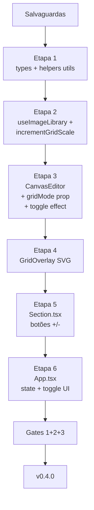

# 🎯 Sprint de Evolução — Modo Grid com Escala Discreta

> **Documento:** Dossier de Sprint — Grid Mode + Discrete Scale
> **Projeto:** Alpha Compose `v0.3.0` → `v0.4.0`
> **Data:** 26/05/2026
> **Idioma:** Português Brasileiro (pt-BR)
> **Premissa:** v0.3.0 (cartesiano N×A) já em produção.

---

## 🎯 Objetivo da Sprint

Adicionar um **modo Grid** opcional (toggle ON/OFF) no canvas que:

1. **Centraliza geometricamente** todo SUB no canvas (vertical + horizontal).
2. **Bloqueia movimentação** dos SUBs (não podem ser arrastados).
3. **Aplica escala discreta** baseada em uma grade de 20×20 fatias do canvas.
4. **Permite ajustar o tamanho** de cada SUB via botões `+` / `-`, em **passos discretos** (1 fatia).
5. **Renderiza o grid visualmente** apenas no preview (export limpo, sem grade).

---

## 📐 Conceitos Fundamentais

### Definição do Grid

```
sliceSize  = min(canvasWidth, canvasHeight) / 20
gridCols   = floor(canvasWidth  / sliceSize)
gridRows   = floor(canvasHeight / sliceSize)
```

**Exemplos práticos:**

| Canvas | Slice (px) | Grade |
|---|:---:|---|
| 1080×1080 (1:1) | 54 | 20×20 |
| 1920×1080 (16:9) | 54 | 35×20 |
| 1080×1440 (3:4) | 54 | 20×26 |
| 800×600 (4:3) | 30 | 26×20 |

> O **menor lado** do canvas é sempre **exatamente 20 fatias**. Os outros lados podem ter mais.

### Escala discreta do SUB (Opção A — bounding box quadrado)

O SUB cabe dentro de um **quadrado N×N fatias** preservando aspect ratio:

```
N        ∈ [1, 20]   (níveis discretos de zoom)
boxSide  = N × sliceSize    (lado do bounding box quadrado)
ratio    = subImage.width / subImage.height

if ratio >= 1 (landscape ou square):
    renderWidth  = boxSide
    renderHeight = boxSide / ratio
else (portrait):
    renderHeight = boxSide
    renderWidth  = boxSide * ratio

scaleFactor = renderWidth / subImage.width   // = renderHeight / subImage.height
```

### Exemplo concreto

Canvas 1080×1080, sliceSize = 54px. SUB com imagem original 800×600.

| N (fatias) | boxSide | renderW × renderH | scale |
|:---:|:---:|---|:---:|
| 1 | 54 | 54 × 40.5 | 0.0675 |
| 5 | 270 | 270 × 202.5 | 0.3375 |
| 10 | 540 | 540 × 405 | 0.675 |
| 20 | 1080 | 1080 × 810 | 1.35 |

### Centralização

```
sub.left = canvas.width / 2
sub.top  = canvas.height / 2
sub.originX = 'center'
sub.originY = 'center'
```

---

## 🔍 Auditoria do Estado Atual (v0.3.0)

### Como SUBs são renderizados hoje

Em [`src/components/CanvasEditor.tsx`](../src/components/CanvasEditor.tsx:130) (criação) e [`linha 172`](../src/components/CanvasEditor.tsx:172) (mudança de role):

```ts
// Subject default: 50% do menor lado disponível, centralizado
const scale = Math.min(canvas.width / img.width, canvas.height / img.height) * 0.5;
fabricImg.set({
  scaleX: scale,
  scaleY: scale,
  left: canvas.width / 2,
  top: canvas.height / 2,
  originX: 'center',
  originY: 'center',
  selectable: true,           // ← arrastável
  visible: img.visible,
});
```

**Características atuais:**
- SUB inicia **centralizado** mas é **arrastável** com `selectable: true`.
- Escala inicial = 50% do menor lado, **livre** após (Fabric permite resize/rotate).
- Não há nível de zoom discreto — o usuário move com mouse.

### Modelo de dados em [`src/types.ts`](../src/types.ts:1)

```ts
export interface UploadedImage {
  id: string;
  url: string;
  name: string;
  width: number;
  height: number;
  role: ImageRole;
  aspectRatio: number;
  visible: boolean;
}
```

---

## 🚀 Novo Modelo (v0.4.0)

### Extensão de tipos

```ts
// src/types.ts
export interface UploadedImage {
  id: string;
  url: string;
  name: string;
  width: number;
  height: number;
  role: ImageRole;
  aspectRatio: number;
  visible: boolean;
  gridScale?: number;   // 1..20, opcional. Default no primeiro toggle = 10.
}
```

> Por que opcional? Para retrocompatibilidade e por SUBs novos não terem gridScale até serem manipulados.

### Estado global — Grid Mode

```ts
// src/App.tsx (ou novo hook useGridMode.ts)
const [gridMode, setGridMode] = useState(false);
```

### Decisão de design final (validada)

| Item | Valor |
|---|---|
| **Escala** | Bounding box quadrado N×N fatias (Opção A) |
| **Range de N** | 1 (menor) até 20 (cobre o lado menor inteiro) |
| **Default N** | 10 (metade do canvas) |
| **Aplicação** | Apenas em SUBs visíveis. BG segue regra cover normal |
| **Centralização** | left = canvasW/2, top = canvasH/2 |
| **Movimentação** | `lockMovementX/Y = true` quando grid ON |
| **Resize manual** | `lockScalingX/Y = true` quando grid ON (zoom só via +/-) |
| **Grade visual** | Renderizada como overlay no preview, **NÃO** no export |
| **Estado individual** | Cada SUB mantém seu próprio `gridScale` |
| **Persistência** | Ao desligar grid, posição/escala original restauradas; ao religar, gridScale anterior aplicado |
| **Botões UI** | `+` / `-` por SUB no card da sidebar (junto de Hide/Move/Delete) |
| **Indicador** | Badge `[N/20]` no card SUB quando grid ON |

---

## 📦 Estrutura de Arquivos a Modificar

| Arquivo | Mudança | Risco |
|---|---|:---:|
| [`src/types.ts`](../src/types.ts:1) | Adicionar `gridScale?: number` | 🟢 |
| [`src/components/CanvasEditor.tsx`](../src/components/CanvasEditor.tsx:1) | Receber prop `gridMode`; aplicar lógica condicional ao SUB; renderizar overlay grid | 🔴 |
| [`src/hooks/useImageLibrary.ts`](../src/hooks/useImageLibrary.ts:1) | Adicionar `setGridScale(id, n)` e `incrementGridScale(id, ±1)` | 🟡 |
| [`src/components/Section.tsx`](../src/components/Section.tsx:1) | Botões `+` / `-` em cada card SUB quando `gridMode` ativo | 🟡 |
| [`src/App.tsx`](../src/App.tsx:1) | Estado `gridMode`, toggle UI no header, prop drilling | 🟡 |
| [`src/lib/utils.ts`](../src/lib/utils.ts:1) | Helper `computeGridSliceSize(canvas)` + `applyGridScale(obj, img, n, sliceSize)` | 🟢 |

### Novo componente proposto: `GridOverlay`

```ts
// src/components/GridOverlay.tsx (novo)
// Renderiza linhas semitransparentes via SVG ou Fabric Lines, sobre o canvas
// Apenas no preview (NÃO entra no canvas.toDataURL pois ficará fora ou será removido antes)
```

> **Decisão crítica:** o grid deve ser renderizado **fora** do `fabric.Canvas` (overlay HTML/SVG) para que `canvas.toDataURL` exporte sem ele. Alternativa: adicionar como objeto Fabric com flag custom e ocultá-lo durante export.

### Modelo escolhido: **overlay SVG fora do canvas**

```jsx
<div className="canvas-wrapper relative">
  <canvas ref={canvasElementRef} />
  {gridMode && (
    <svg className="absolute inset-0 pointer-events-none">
      {/* linhas verticais e horizontais a cada sliceSize */}
    </svg>
  )}
</div>
```

**Vantagens:**
- Zero impacto na exportação (SVG não está no canvas raster).
- Renderização barata.
- Pode usar Tailwind/CSS para estilizar.

---

## 🎨 UX e UI

### Header — Toggle Grid Mode

Adicionar à esquerda do seletor de Ratio:

```
[ ⊞ GRID ON ]   [Ratio: 1:1 3:4 9:16 ...]
```

Quando ativo: badge azul + ícone preenchido.
Ao desativar: SUBs voltam ao modo livre (movimento + resize com mouse).

### Card SUB na Sidebar

```
┌─ SUB Card ─────────────────────────┐
│ [thumb] person.png                 │
│         [Hide] [Move] [Delete]     │
│ ─────── (visível só com grid ON):  │
│         [-] [10/20] [+]            │
└────────────────────────────────────┘
```

- **`-`**: decrementa (mín 1)
- **`+`**: incrementa (máx 20)
- **`[10/20]`**: indicador atual / máximo

### Indicador no Canvas

Quando grid ativo, exibir uma label discreta no canto superior direito:
```
GRID 20×20 · slice 54px
```

---

## 🔧 Pseudocódigo Crítico

### Helper em `src/lib/utils.ts`

```ts
export function computeGridSliceSize(canvasWidth: number, canvasHeight: number): number {
  return Math.min(canvasWidth, canvasHeight) / 20;
}

export function applyGridScaleToSubject(
  fabricImg: fabric.FabricImage,
  imgWidth: number,
  imgHeight: number,
  gridScale: number,        // 1..20
  canvasWidth: number,
  canvasHeight: number
): void {
  const sliceSize = computeGridSliceSize(canvasWidth, canvasHeight);
  const boxSide = gridScale * sliceSize;
  const ratio = imgWidth / imgHeight;

  let renderWidth: number, renderHeight: number;
  if (ratio >= 1) {
    renderWidth = boxSide;
    renderHeight = boxSide / ratio;
  } else {
    renderHeight = boxSide;
    renderWidth = boxSide * ratio;
  }

  const scale = renderWidth / imgWidth;

  fabricImg.set({
    scaleX: scale,
    scaleY: scale,
    left: canvasWidth / 2,
    top: canvasHeight / 2,
    originX: 'center',
    originY: 'center',
    lockMovementX: true,
    lockMovementY: true,
    lockScalingX: true,
    lockScalingY: true,
    lockRotation: true,
  });
}

export function unlockSubject(fabricImg: fabric.FabricImage): void {
  fabricImg.set({
    lockMovementX: false,
    lockMovementY: false,
    lockScalingX: false,
    lockScalingY: false,
    lockRotation: false,
  });
}
```

### Lógica de toggle em `CanvasEditor.tsx`

```ts
useEffect(() => {
  const canvas = fabricCanvasRef.current;
  if (!canvas) return;

  if (gridMode) {
    // Para cada SUB: aplicar gridScale (default 10 se não definido)
    images.filter(i => i.role === 'subject').forEach(img => {
      const obj = objectsRef.current.get(img.id);
      if (!obj) return;
      const scale = img.gridScale ?? 10;
      applyGridScaleToSubject(obj, img.width, img.height, scale, canvas.width, canvas.height);
    });
  } else {
    // Desligar: destravar movimentação (manter posição atual)
    images.filter(i => i.role === 'subject').forEach(img => {
      const obj = objectsRef.current.get(img.id);
      if (obj) unlockSubject(obj);
    });
  }
  canvas.requestRenderAll();
}, [gridMode, images]);
```

### Hook `useImageLibrary.ts` — adicionar

```ts
const incrementGridScale = useCallback((id: string, delta: 1 | -1) => {
  setImages(prev => prev.map(img => {
    if (img.id !== id) return img;
    const current = img.gridScale ?? 10;
    const next = Math.max(1, Math.min(20, current + delta));
    return { ...img, gridScale: next };
  }));
}, []);
```

---

## 🛡️ Salvaguardas (Pre-Sprint)

### S1 — Tag de segurança

```bash
git tag -a pre-grid-v0.3.0 -m "Estado-base antes da sprint Grid Mode"
git push origin --tags
```

### S2 — Branch isolada

```bash
git switch -c feature/grid-mode
```

### S3 — Backups

```bash
mkdir -p backups/sprint-grid-mode
cp src/components/CanvasEditor.tsx  backups/sprint-grid-mode/CanvasEditor.tsx.bak
cp src/components/Section.tsx       backups/sprint-grid-mode/Section.tsx.bak
cp src/hooks/useImageLibrary.ts     backups/sprint-grid-mode/useImageLibrary.ts.bak
cp src/App.tsx                      backups/sprint-grid-mode/App.tsx.bak
cp src/types.ts                     backups/sprint-grid-mode/types.ts.bak
cp src/lib/utils.ts                 backups/sprint-grid-mode/utils.ts.bak
git add backups/ && git commit -m "chore(backup): snapshot pré-sprint Grid Mode"
```

### S4 — Baseline

```bash
npm run lint && npm run build
```

### S5 — Smoke baseline da v0.3.0

- Upload 1 SUB + 1 BG → Generate Pack 1K → ZIP gerado correto.
- Mover SUB com mouse → posição muda.
- Confirmar que o estado atual de v0.3.0 funciona sem regressões.

---

## 📦 Etapas da Sprint



### Etapa 1 — Tipos e helpers
- Adicionar `gridScale?: number` em [`UploadedImage`](../src/types.ts:3)
- Implementar `computeGridSliceSize()`, `applyGridScaleToSubject()`, `unlockSubject()` em [`utils.ts`](../src/lib/utils.ts:1)

### Etapa 2 — Hook
- Adicionar `incrementGridScale(id, ±1)` em [`useImageLibrary.ts`](../src/hooks/useImageLibrary.ts:1)
- Garantir clamp [1, 20]

### Etapa 3 — CanvasEditor
- Receber prop `gridMode: boolean`
- Effect que reage a `gridMode` + `images` aplicando `applyGridScaleToSubject` ou `unlockSubject`
- Garantir que o cleanup ao desligar mantém os SUBs visíveis no centro

### Etapa 4 — GridOverlay
- Componente SVG novo em [`src/components/GridOverlay.tsx`](../src/components/GridOverlay.tsx:1)
- Renderiza linhas semi-transparentes a cada `sliceSize`
- Aparece apenas quando `gridMode === true`
- **Não** entra no canvas Fabric — fica num `<div>` overlay com `position: absolute`

### Etapa 5 — Section
- Adicionar botões `+` / `-` no card SUB **apenas** quando `gridMode` ativo
- Indicador `[N/20]`
- Passar prop `gridMode` e callback `onIncrementScale`

### Etapa 6 — App
- Estado `gridMode`
- Botão toggle no header
- Prop drilling para `CanvasEditor`, `Section`, `GridOverlay`

---

## 🧪 Matriz de Smoke Tests

### Passa Baixo

| # | Setup | Esperado |
|:-:|---|---|
| L1 | Toggle Grid ON sem SUBs | Grade visível, sem crash |
| L2 | Upload 1 SUB, ligar Grid | SUB centralizado, escala = 10/20, lock movement |
| L3 | Click `+` → 11/20 | SUB cresce visualmente; centro permanece |
| L4 | Click `+` 9× → 20/20 | SUB ocupa todo lado menor do canvas |
| L5 | Click `-` 19× → 1/20 | SUB ocupa 1 fatia (mínimo) |
| L6 | Click `+` em 20/20 | Sem efeito (clamp), sem warning |
| L7 | Toggle Grid OFF | SUB volta a ser arrastável; mantém posição central |
| L8 | Toggle Grid ON novamente | gridScale anterior reaplicado |
| L9 | Generate Pack com Grid ON | ZIP gerado **sem grid lines no PNG** ✅ |

### Passa Alto

| # | Setup | Esperado |
|:-:|---|---|
| H1 | 3 SUBs + 3 BGs + Grid ON | 9 PNGs (cartesiano) com cada SUB centralizado e em sua escala individual |
| H2 | Grid ON + ratio 16:9 | Grade adapta (35×20), slice = canvasH/20 |
| H3 | Grid ON + ratio 9:16 | Grade adapta (20×35), slice = canvasW/20 |
| H4 | Trocar ratio com Grid ON | SUB recalcula posição/escala (centro permanece, slice atualiza) |
| H5 | SUB com ratio extremo (ex: 100×500 = 1:5) | Cabe em N×N preservando ratio |
| H6 | Inspecionar PNG do export | Sem grid lines, SUB centralizado, tamanho discreto correto |
| H7 | Console (F12) durante toggle | Zero erros |

### Passa Crítico

| # | Setup | Esperado |
|:-:|---|---|
| C1 | Mover SUB com mouse durante Grid ON | Movimento bloqueado (lock funcionando) |
| C2 | Resize SUB com mouse durante Grid ON | Resize bloqueado (lock funcionando) |
| C3 | gridScale = 1 em SUB landscape extremo (1000×100) | renderH = sliceSize/10 (proporcional) |

---

## 🚦 Gates

- **Gate 1:** lint + build
- **Gate 2:** L1-L9 OK
- **Gate 3 (opcional):** H1-H7 + C1-C3

---

## 🎬 Plano de Rollback

| Cenário | Comando |
|---|---|
| Falha na sprint | `git switch main && git reset --hard pre-grid-v0.3.0` |
| Etapa específica | `git restore --source=accept-etapa-{N-1} -- src/` |
| Bug em produção | Re-deploy `v0.3.0` |

---

## ❓ Decisões Pendentes (validar)

1. **D1** — Nível default ao primeiro toggle: 10/20? ✅ proposto
2. **D2** — Comportamento ao desligar: SUB mantém posição central + escala atual ou volta ao default 50%? Proposto: **mantém posição/escala**, mas destrava manipulação manual.
3. **D3** — Grid overlay: linhas finas brancas com 5-10% opacity? Outro estilo?
4. **D4** — Indicador `[N/20]` no card SUB ou em outro lugar (badge no canvas)?
5. **D5** — Toggle no header (esquerda do Ratio) ou na sidebar direita?
6. **D6** — Atalho de teclado (ex: `G` para toggle)?

---

## 📊 Estimativa de Impacto

| Métrica | v0.3.0 | v0.4.0 (estimado) |
|---|:---:|:---:|
| Linhas de código modificadas | — | ~250 |
| Novos arquivos | — | 1 (GridOverlay) |
| Novos campos em modelos | — | 1 (gridScale) |
| Novos hooks/utilitários | — | 3 helpers + 1 ação |
| Risco regressão | — | 🟡 médio (toca Fabric+Section+App) |

---

> **Autor:** Agent Architect (Roo)
> **Status:** 🟡 Aguardando aprovação e respostas às decisões pendentes (D2-D6)
> **Documentos predecessores:** [`auditoria-alpha-compose.md`](auditoria-alpha-compose.md:1), [`refatoracao-alpha-compose.md`](refatoracao-alpha-compose.md:1), [`sprint-iteracao-sub.md`](sprint-iteracao-sub.md:1)
