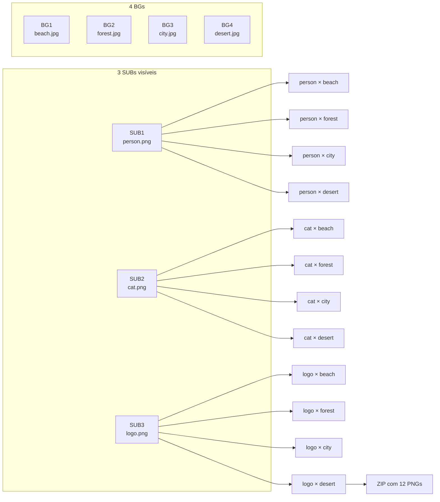
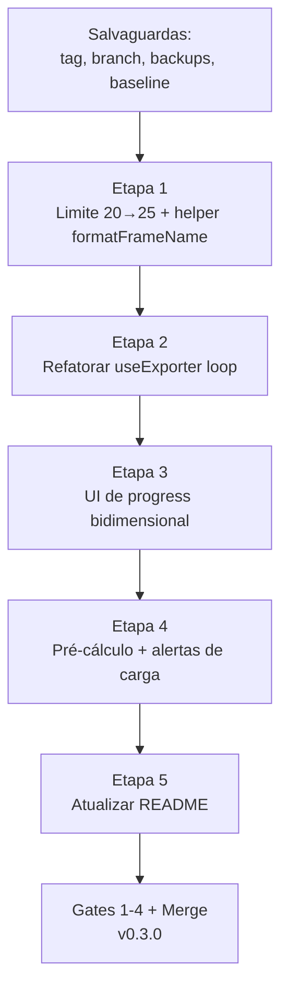

# 🚀 Sprint de Evolução — Iteração na Camada SUB

> **Documento:** Dossier de Sprint — Algoritmo N × A (Cartesian Product)
> **Projeto:** Alpha Compose `v0.2.0` → `v0.3.0`
> **Data:** 26/05/2026
> **Idioma:** Português Brasileiro (pt-BR)
> **Premissa:** Auditoria + Refatoração já concluídas em [`plans/refatoracao-alpha-compose.md`](refatoracao-alpha-compose.md:1)

---

## 🎯 Objetivo da Sprint (Regras Consolidadas pelo Usuário)

Evoluir a **engine de export recursivo** para iterar **simultaneamente** na camada de Backgrounds (BG) **e** na camada de Subjects (SUB), gerando o **produto cartesiano** das imagens **visíveis** das duas dimensões.

### 📜 Fórmula final aprovada

```
IMAGENS_RENDERIZADAS = BGs(show) × SUBs(show)
```

Onde:
- **BGs(show)** = backgrounds com `visible === true`
- **SUBs(show)** = subjects com `visible === true`
- Imagens em **hide** são **silenciosamente ignoradas** (skip), sem warning, sem alteração no contador

### 🚫 Restrição absoluta (invariante)

> **Jamais devem ser geradas imagens que contenham 2 ou mais SUBs fundidos no mesmo frame.**
> Cada frame de saída contém **exatamente 1 BG + 1 SUB** (ou 1 BG + 0 SUB se nenhum SUB visível).

### 📦 Limite de imagens

**25 imagens no total** (BG + SUB combinados, sem distinção de role).

**Caso extremo possível:**
- 12 BG visíveis × 13 SUB visíveis = **156 imagens geradas**
- 13 BG visíveis × 12 SUB visíveis = **156 imagens geradas**
- 25 BG visíveis × 0 SUB visíveis = **25 imagens** (legacy mode)
- 1 BG visível × 24 SUB visíveis = **24 imagens**

---

## 🔍 Auditoria da Engine Atual

### Algoritmo vigente (v0.2.0)

Localização: [`src/hooks/useExporter.ts`](../src/hooks/useExporter.ts:93) — função [`downloadAll()`](../src/hooks/useExporter.ts:28)

#### Fluxo passo a passo

```mermaid
flowchart TD
    Start([Generate Pack]) --> Filter[Filtra bgImages e subImages]
    Filter --> Validate{bgImages.length > 0?}
    Validate -->|não| Notify1[Toast: select at least one BG]
    Validate -->|sim| Init[Cria Worker + calcula multiplier]
    Init --> Loop{Para i de 0 a N-1}
    Loop --> Cancel{cancelled?}
    Cancel -->|sim| Cleanup
    Cancel -->|não| Toggle[Toggle visibility:<br/>BG[i] visível,<br/>todos SUB visíveis]
    Toggle --> Render[canvas.renderAll]
    Render --> Capture[toDataURL multiplier]
    Capture --> Worker[postMessage para zipWorker]
    Worker --> RAF[await double rAF]
    RAF --> Loop
    Loop -->|fim| Cleanup[Restaura visibilidade]
    Cleanup --> Generate[Worker gera ZIP]
    Generate --> Download[Download alpha_compose_RES_pack.zip]
```

#### Característica essencial

> **Os subjects nunca são iterados.** Todos os SUB com `visible: true` aparecem **simultaneamente** em **todos** os frames gerados.

```typescript
// Trecho atual: src/hooks/useExporter.ts linhas 102-113
allObjects.forEach(obj => {
  if (imageRole === 'background') {
    obj.set('visible', imageId === currentBg.id);  // ← um BG por vez
  } else if (imageRole === 'subject') {
    const subData = subImages.find(s => s.id === imageId);
    obj.set('visible', subData ? subData.visible : false);  // ← TODOS visíveis
  }
});
```

### Tabela de comportamento atual

| Setup | Output |
|---|---|
| 3 BGs + 0 SUBs visíveis | 3 PNGs (sem subjects) |
| 3 BGs + 1 SUB visível | 3 PNGs (cada com o mesmo SUB) |
| 3 BGs + 4 SUBs visíveis | 3 PNGs (cada com **todos os 4 SUBs sobrepostos**) |
| 0 BGs + N SUBs | ❌ erro: "select at least one BG" |

### Convenção atual de nomenclatura

- **PNGs no ZIP:** `compose_{i+1}_{nomeOriginalSemExt}_{1K|2K|4K}.png`
  - Exemplo: `compose_1_montanha_4K.png`
- **ZIP final:** `alpha_compose_{1K|2K|4K}_pack.zip`
- **Progress UI:** `Generating: {current} / {total}` onde total = N (apenas backgrounds)

### Limites atuais

- Limite **total** de imagens: 20 (BG + SUB + none somados) em [`src/hooks/useImageLibrary.ts`](../src/hooks/useImageLibrary.ts:20)
- Sem limite específico por role.

---

## 🚀 Proposta da Nova Engine (v0.3.0)

### Regra de negócio nova (consolidada)

```
visibleBGs  = images.filter(role=background AND visible=true)
visibleSUBs = images.filter(role=subject    AND visible=true)

Para cada SUB visível S em visibleSUBs:
    Para cada BG visível B em visibleBGs:
        - Apenas S é visível na camada de subjects (todos os outros SUBs invisíveis)
        - Apenas B é visível na camada de backgrounds (todos os outros BGs invisíveis)
        - Renderiza canvas
        - Adiciona ao ZIP

# Caso especial (legacy compat): se visibleSUBs.length === 0
#   Para cada BG visível B em visibleBGs:
#     - Renderiza apenas o BG (sem nenhum SUB visível)
#     - Adiciona ao ZIP

# Pré-condição (validação dura):
#   if visibleBGs.length === 0 → ERRO: "select at least one visible background"
```

### Invariantes a preservar

1. **Cada frame de saída contém ≤ 1 SUB** (zero se não houver SUB visível, exatamente 1 caso contrário).
2. **Cada frame contém exatamente 1 BG visível**.
3. **SUBs/BGs em hide nunca aparecem na saída**, mesmo no caso de o usuário ter feito hide durante o setup.
4. **A ordem dos frames é determinística** (SUB-outer/BG-inner conforme pedido).

### Resultado esperado



### Tabela de comportamento novo

> Convenção: `BG visíveis × SUB visíveis = frames gerados`. SUBs/BGs em hide **não contam**.

| Setup | Output (era) | Output (novo) |
|---|---|---|
| 3 BG vis. + 1 SUB vis. | 3 PNGs | **3 PNGs** (igual) |
| 3 BG vis. + 2 SUB vis. (1 SUB hide) | 3 PNGs (com 3 sobrepostos) | **6 PNGs** (apenas os 2 SUB visíveis × 3 BGs) |
| 5 BG vis. + 4 SUB vis. | 5 PNGs | **20 PNGs** |
| 12 BG vis. + 13 SUB vis. (limite máximo) | — | **156 PNGs** |
| 25 BG vis. + 0 SUB | 25 PNGs (vazios) | **25 PNGs** (legacy compat) |
| 0 BG vis. + N SUB | erro | **erro** (precisa pelo menos 1 BG visível) |
| 5 BG (3 hide) + 4 SUB (2 hide) | 2 PNGs com 4 SUBs sobrepostos | **2 BG vis × 2 SUB vis = 4 PNGs** ✅ |

### Pseudocódigo da nova engine (consolidado)

```typescript
// Filtra APENAS visíveis em ambas as camadas
const visibleBgs  = images.filter(i => i.role === 'background' && i.visible);
const visibleSubs = images.filter(i => i.role === 'subject'    && i.visible);

// Validação dura: precisa de pelo menos 1 BG visível
if (visibleBgs.length === 0) {
  notify('Select at least one visible background.', 'warning');
  return;
}

// Cálculo total: legacy compat se A=0
const N = visibleBgs.length;
const A = visibleSubs.length;
const totalFrames = N * Math.max(A, 1);
// 12 BG × 13 SUB = 156 (caso extremo do limite 25)

let frameIndex = 0;

// Loop EXTERNO: SUBs visíveis (ou um único pass se A=0)
for (let s = 0; s < Math.max(A, 1); s++) {
  const currentSub = visibleSubs[s] ?? null;  // null se A=0

  // Loop INTERNO: BGs visíveis
  for (let b = 0; b < N; b++) {
    if (cancelled) break;

    frameIndex++;
    setExportProgress({
      current: frameIndex,
      total: totalFrames,
      currentSub: s + 1,
      totalSubs: Math.max(A, 1),
      currentBg: b + 1,
      totalBgs: N,
    });

    const currentBg = visibleBgs[b];

    // INVARIANTE: apenas 1 BG e (no máximo) 1 SUB visível
    allObjects.forEach(obj => {
      if (obj._imageRole === 'background') {
        // Apenas o BG da iteração atual; demais BGs invisíveis (incluindo BG em hide pelo usuário)
        obj.set('visible', obj._imageId === currentBg.id);
      } else if (obj._imageRole === 'subject') {
        // Apenas o SUB atual; SUB em hide ou outros SUBs => invisíveis
        obj.set('visible', currentSub !== null && obj._imageId === currentSub.id);
      }
    });

    canvas.renderAll();
    // toDataURL → Uint8Array → worker.postMessage('add-frame', ...)
  }
}
```

### ⚠️ Garantia da invariante "no merge SUBs"

A linha-chave é:

```typescript
obj.set('visible', currentSub !== null && obj._imageId === currentSub.id);
```

Como ela é executada **em cada SUB do canvas a cada iteração**, é matematicamente impossível dois SUBs estarem `visible: true` ao mesmo tempo durante o capture. Mesmo se o usuário tentasse manipular o estado externamente, o loop sobrescreve antes do `renderAll()`.

---

## 📐 Decisões de Design

### D1 — Ordem de iteração: SUB-outer / BG-inner

**Decisão:** loop externo varre SUBs, loop interno varre BGs.

**Motivação:**
- O usuário pediu literalmente: *"primeira passagem para a primeira imagem SUB com cada um dos N bgs e depois mais uma passagem com a segunda imagem SUB com mais N bgs"*
- Agrupa visualmente os outputs por sujeito (todas as variações de fundo de cada personagem juntas).
- Permite ao usuário identificar rapidamente as variações de cada personagem.

**Alternativa rejeitada:** BG-outer / SUB-inner agruparia por cenário, mas vai contra o pedido explícito.

### D2 — Comportamento quando A = 0 (nenhum SUB visível) ✅ APROVADO

**Decisão:** Gerar `N` imagens (apenas backgrounds visíveis), preservando o comportamento legado.

**Motivação:** Usuários que querem apenas exportar packs de backgrounds sem subjects não devem ser bloqueados. `Math.max(A, 1)` mantém retrocompatibilidade.

**Diferença vital:** SUBs em **hide** são **silenciosamente ignorados** — não geram erro, não disparam warning, simplesmente não entram na iteração.

### D3 — Convenção de nomes (granular)

**Padrão proposto:**

```
compose_S{índice_sub}_B{índice_bg}_{nome_sub}__{nome_bg}_{1K|2K|4K}.png
```

**Exemplos:**
- `compose_S1_B1_person__beach_2K.png`
- `compose_S1_B2_person__forest_2K.png`
- `compose_S2_B1_cat__beach_2K.png`

**Quando A = 0** (sem subjects):
- `compose_S0_B1_nosub__beach_2K.png` ou simplesmente `compose_B1_beach_2K.png` (decisão a confirmar).

**Sanitização:** ambos os nomes (sub e bg) passam por [`sanitizeFilename()`](../src/lib/utils.ts:10) já existente.

**Razão dos `__` duplos:** separador visual entre os dois nomes para facilitar parsing humano.

### D4 — Limite total de imagens ✅ APROVADO

**Decisão:** Limite **25 imagens TOTAIS** (BG + SUB combinados), sem distinção de role. Permite:
- 12 BG + 13 SUB → **156 frames** (caso extremo absoluto)
- 13 BG + 12 SUB → **156 frames**
- 25 BG + 0 SUB → 25 frames (legacy)
- 1 BG + 24 SUB → 24 frames
- ...qualquer combinação cuja soma seja ≤ 25

**Pico de carga absoluto:** 156 imagens em 4K — bem mais gerenciável que os 600 originais. Modal de confirmação ainda recomendado para 4K.

### D5 — Progress UI bidimensional

**Decisão:** exibir contagem dupla:

```
Generating SUB 2 / 3 · BG 4 / 5    (frame 9 / 15)
```

ou versão mais compacta:

```
Frame 9 / 15  ·  S2/3 B4/5
```

**Aria-live:** atualiza a cada frame.

### D6 — Pré-cálculo do total e aviso de carga ✅ APROVADO (revisado)

Antes de iniciar, calcular:

```ts
const visibleBgs  = images.filter(i => i.role === 'background' && i.visible);
const visibleSubs = images.filter(i => i.role === 'subject'    && i.visible);

const N = visibleBgs.length;
const A = visibleSubs.length;
const totalFrames = N * Math.max(A, 1);
```

**Limites de aviso (revisados para teto 156):**

| `totalFrames` | Resolução | Comportamento |
|:---:|:---:|---|
| ≤ 30 | qualquer | Inicia direto |
| 31–80 | qualquer | Toast informativo "Generating {X} frames..." |
| > 80 | 4K | **Modal de confirmação:** "Generate {X} frames at 4K? This may take several minutes." |
| > 80 | 1K/2K | Toast warning "Large pack: {X} frames being generated." |

### D7 — Cancelamento granular

O botão **Cancel** existente continua funcionando — interrompe na **fronteira do próximo frame** (sub atual termina, mas próximo não inicia).

---

## 🔧 Arquivos a Modificar

| Arquivo | Alteração | Risco |
|---|---|:---:|
| [`src/hooks/useExporter.ts`](../src/hooks/useExporter.ts:1) | Refatorar loop principal para SUB-outer/BG-inner; expandir `ExportProgress` | 🔴 |
| [`src/hooks/useImageLibrary.ts`](../src/hooks/useImageLibrary.ts:20) | Aumentar limite 20 → 25 | 🟢 |
| [`src/App.tsx`](../src/App.tsx:1) | Atualizar UI de progress para mostrar S/A · B/N | 🟡 |
| [`src/lib/utils.ts`](../src/lib/utils.ts:1) | Adicionar `formatFrameName(s, b, subName, bgName, res)` | 🟢 |
| [`src/types.ts`](../src/types.ts:1) | Não muda | — |
| [`src/components/Section.tsx`](../src/components/Section.tsx:1) | Não muda | — |
| [`src/workers/zipWorker.ts`](../src/workers/zipWorker.ts:1) | Não muda (continua agnóstico) | — |
| [`README.md`](../README.md:1) | Atualizar tabela de fluxo | 🟢 |

### Mudança proposta no tipo `ExportProgress`

```typescript
// src/hooks/useExporter.ts
interface ExportProgress {
  current: number;      // frame index (1-based)
  total: number;        // total frames = A × N
  currentSub: number;   // novo
  totalSubs: number;    // novo
  currentBg: number;    // novo
  totalBgs: number;     // novo
}
```

---

## 🛡️ Salvaguardas (Pre-Sprint)

> Mesma filosofia da refatoração anterior: nenhuma linha tocada antes destes 5 itens estarem ✅.

### S1 — Tag de segurança da v0.2.0

```bash
git tag -a pre-sprint-v0.2.0 -m "Estado-base antes da sprint de iteração SUB"
git push origin --tags
```

### S2 — Branch isolada

```bash
git switch -c feature/iterate-sub-axis
```

### S3 — Backups dos 4 arquivos alvo

```bash
mkdir -p backups/sprint-iteracao-sub
cp src/hooks/useExporter.ts       backups/sprint-iteracao-sub/useExporter.ts.bak
cp src/hooks/useImageLibrary.ts   backups/sprint-iteracao-sub/useImageLibrary.ts.bak
cp src/App.tsx                    backups/sprint-iteracao-sub/App.tsx.bak
cp src/lib/utils.ts               backups/sprint-iteracao-sub/utils.ts.bak
git add backups/ && git commit -m "chore(backup): snapshot pré-sprint iteração SUB"
```

### S4 — Baseline de saúde

```bash
npm run lint > backups/sprint-iteracao-sub/baseline-lint.log 2>&1
npm run build > backups/sprint-iteracao-sub/baseline-build.log 2>&1
```

### S5 — Smoke baseline da v0.2.0

Executar e registrar:
- 3 BG + 2 SUB visíveis + 1K + 1:1 → ZIP com **3 PNGs** (cada com 2 sobrepostos)
- Verificar console limpo

---

## 🧪 Matriz de Smoke Tests

### Passa Baixo (após implementação)

| # | Setup | Esperado |
|:-:|---|---|
| L1 | 1 BG vis. + 1 SUB vis. | 1 PNG, ratio correto |
| L2 | 2 BG vis. + 1 SUB vis. | 2 PNGs, ambos com mesmo SUB |
| L3 | 1 BG vis. + 2 SUB vis. | **2 PNGs**, cada com SUB diferente |
| L4 | 2 BG vis. + 2 SUB vis. | **4 PNGs**, ordem `S1-B1, S1-B2, S2-B1, S2-B2` |
| L5 | 3 BG vis. + 0 SUB | 3 PNGs (apenas backgrounds, legacy compat) |
| L6 | Cancelar no meio (4 BG × 3 SUB → cancela após frame 5) | ZIP parcial com 5 PNGs |
| **L7** | **3 BG vis. + 3 SUB (1 em hide)** | **6 PNGs (apenas 2 SUBs visíveis × 3 BGs)** ✅ |
| **L8** | **3 BG (1 em hide) + 2 SUB vis.** | **4 PNGs (2 BGs visíveis × 2 SUBs)** ✅ |
| **L9** | **Hide last SUB e last BG simultaneamente** | Frames excluem ambos do output |

### Passa Alto

| # | Setup | Esperado |
|:-:|---|---|
| H1 | 5 BG vis. + 5 SUB vis. (25 frames) + 4K | ZIP com 25 PNGs em alta-res |
| H2 | 25 imagens (15 BG vis. + 10 SUB vis.) → 150 frames + 1K | Toast de carga + ZIP gerado |
| H3 | 1 BG vis. + 24 SUB vis. (limite válido) | 24 PNGs, ordem correta |
| H4 | Toggle visibility durante export ❌ | Botão Generate desabilitado durante export |
| H5 | Nome de arquivo com `/`, `\`, `:` em SUB e BG | Sanitização preserva legibilidade |
| H6 | Console (DevTools) durante export | Zero erros, FPS ≥ 50 (Worker ativo) |
| H7 | Tentar upload da imagem 26 | Toast "Maximum 25 images allowed" |
| **H8** | **Inspecionar cada PNG do ZIP gerado em H1** | **Invariante: nunca há 2 SUBs no mesmo frame** ✅ |

### Passa Crítico (limites e edge cases)

| # | Setup | Esperado |
|:-:|---|---|
| C1 | 12 BG vis. + 13 SUB vis. = **156 frames** + 4K | Modal de confirmação aparece antes de iniciar |
| C2 | 12 BG vis. + 13 SUB vis. + 1K = 156 frames | Inicia (sem modal), gera ZIP, console sem OOM |
| C3 | Cancelar imediatamente após click em Generate | ZIP não é gerado, toast "Export cancelled" |
| **C4** | **0 BG vis. (todos hide) + 5 SUB vis.** | Toast: "select at least one visible background" |
| **C5** | **25 BG todos em hide** | Toast: "select at least one visible background" |

---

## 🚦 Gates de Aprovação por Etapa

### Gate 1 — Dry-Run

```bash
npm run lint && npm run build
```

Critério: ambos com exit 0.

### Gate 2 — Smoke Passa Baixo

L1 a L6 OK no browser.

### Gate 3 — Smoke Passa Alto

H1 a H7 OK + verificar Memory tab para vazamentos.

### Gate 4 — Smoke Passa Crítico

C1 a C3 OK.

---

## 📦 Etapas da Sprint



### Etapa 1 — Limite + Helper

**Escopo:**
- Em [`useImageLibrary.ts`](../src/hooks/useImageLibrary.ts:20): trocar `> 20` por `> 25` e atualizar mensagem.
- Em [`utils.ts`](../src/lib/utils.ts:1): adicionar `formatFrameName(s, b, subName, bgName, res)`.

**Critério:** Gate 1 + L7 (limite 26 → toast).

### Etapa 2 — Loop Cartesiano

**Escopo:** Refatorar `downloadAll()` em [`useExporter.ts`](../src/hooks/useExporter.ts:28).

**Critério:** Gate 1 + L1 a L5 OK.

### Etapa 3 — UI de Progress Bidimensional

**Escopo:** Atualizar `ExportProgress` + UI em [`App.tsx`](../src/App.tsx:1).

**Critério:** Gate 1 + visualização correta durante export.

### Etapa 4 — Pré-cálculo + Alertas

**Escopo:** Adicionar lógica de aviso/modal em `downloadAll`.

**Critério:** C1 dispara modal; C2 não dispara modal; H2 dispara toast informativo.

### Etapa 5 — Documentação

**Escopo:** Atualizar [`README.md`](../README.md:1) com nova fórmula `N × A` e tabela de exemplos.

**Critério:** Markdown válido + diagrama Mermaid renderiza.

---

## 🎬 Plano de Rollback

| Cenário | Comando |
|---|---|
| Falha em uma etapa | `git restore --source=accept-etapa-{N-1} -- src/` |
| Reverter sprint inteira | `git switch main && git reset --hard pre-sprint-v0.2.0` |
| Regressão em produção | Re-deploy da tag `v0.2.0` |

---

## 📋 Decisões Pendentes (precisam de aprovação)

Antes de implementar, preciso confirmar com o usuário:

1. **D1** — Ordem SUB-outer/BG-inner está OK? (sim, já confirmado pelo pedido)
2. **D2** — Quando A = 0, gerar só com BGs (mantém compat) **ou** bloquear com erro?
3. **D3** — Convenção de nome: `compose_S1_B2_person__beach_2K.png` está OK ou prefere outra?
4. **D4** — Limite **25 total** ou prefere **25 por role** (50 total)?
5. **D5** — UI de progress: formato `Frame 9 / 15 · S2/3 B4/5` ou outro?
6. **D6** — Modal de confirmação acima de 100 frames em 4K — limites OK?

---

## 📊 Estimativa de Impacto

| Métrica | v0.2.0 | v0.3.0 (estimado) |
|---|:---:|:---:|
| Capacidade máxima de imagens | 20 | **25** |
| Frames possíveis em um único export | máx 20 | máx **600** (25 × 24) |
| Linhas de código modificadas | — | ~150 |
| Novos arquivos | — | 0 (refactor in-place) |
| Risco de regressão | — | 🔴 alto (loop principal alterado) |

---

## 🗂️ Próximos Passos Imediatos

1. ✅ Aprovação deste dossier
2. ⏳ Confirmar decisões pendentes (D2-D6)
3. ⏳ Switch para Code mode → executar S1-S5 (salvaguardas)
4. ⏳ Implementar Etapas 1-5 com gates
5. ⏳ Smoke tests + merge → tag `v0.3.0`

---

> **Autor:** Agent Architect (Roo)
> **Status:** 🟡 Aguardando aprovação e respostas às decisões pendentes
> **Documento-base:** [`plans/auditoria-alpha-compose.md`](auditoria-alpha-compose.md:1) · [`plans/refatoracao-alpha-compose.md`](refatoracao-alpha-compose.md:1)
